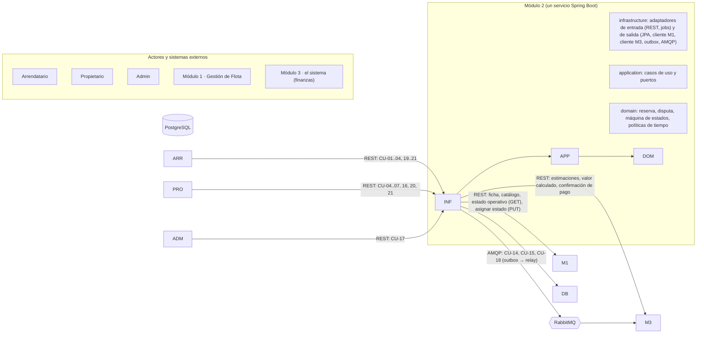
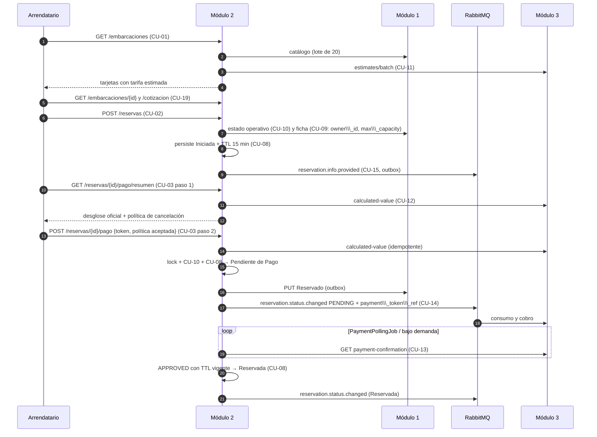

# Implementation Plan: Módulo 2 — Operación de Reservas, Tiempos y Cancelaciones (SEA-SHARE)

**Date**: 2026-10-10
**Spec**: `features/CU-01…CU-21/spec.md`. **Única fuente de verdad.** `context/sea-share.md` y `context/consistencia-m2-m3.md` son referencia secundaria; cuando discrepan de un spec, prevalece el spec.
**Contratos**: [`contracts/`](contracts/README.md) — un archivo `.md` por contrato (REST expuesto, colas publicadas e integraciones externas consumidas).
**Contrapartes**: Módulo 3 ("el sistema", plan de 2026-10-08, contratos UC01–UC13) y Módulo 1 (Gestión de Flota).

\---

## Summary

Módulo 2 es el dueño del ciclo de vida de la reserva: busca y detalla embarcaciones, crea la reserva (Iniciada), bloquea el inventario al iniciar el pago, confirma el pago consultando a Módulo 3, controla los tiempos (TTL de 15 min, tolerancia de 30 min, ventanas de cancelación de 72 h y 24 h), registra check-in, check-out, inasistencia y cancelación, y gestiona la disputa de garantía. Se construye como **un único servicio Spring Boot (Java 21 + Spring Boot 3.5) con arquitectura hexagonal y dos contextos acotados (Reservas y Disputa de Garantía)**, con **PostgreSQL 16**, **RabbitMQ** (publicación garantizada hacia Módulo 3) y **Docker**.

Este documento define el orden **general**: arquitectura, tecnologías, estructura, modelo de datos, conexiones, índice de contratos, decisiones y hoja de ruta. De él se derivará un plan **específico** por CU en `features/CU-nn-\\\*/plan.md`.

\---

## Technical Context

**Qué es Módulo 2 técnicamente:** un único servicio backend. Expone una API REST para los usuarios, llama a Módulo 1 y a Módulo 3, y publica mensajes a Módulo 3 por RabbitMQ.

### Plataforma base

|Elemento|Elección|Para qué se usa|
|-|-|-|
|Lenguaje|Java 21 (LTS)|Lenguaje del servicio, con soporte de largo plazo|
|Framework|Spring Boot 3.5.x|Base de la aplicación, arranque y configuración|
|Ejecución|Contenedores Docker (Linux)|Despliegue; en local se levanta todo con Docker Compose|
|Tipo de proyecto|Backend REST + worker de mensajería|Un solo servicio que atiende HTTP y publica/procesa mensajes|

### Librerías principales

|Necesidad|Librería|Qué resuelve en el proyecto|
|-|-|-|
|API REST|Spring Web MVC|Endpoints de CU-01 a CU-21|
|Validación|Spring Validation|Rechazar datos mal formados antes de procesar (fechas, pasajeros, teléfono)|
|Base de datos|Spring Data JPA (Hibernate)|Leer y guardar reservas y disputas|
|Migraciones|Flyway|Versionar los cambios del esquema de la base de datos|
|Seguridad|Spring Security (OAuth2 Resource Server)|Validar el token del usuario y sus roles (Arrendatario, Propietario, Admin)|
|Mensajería|Spring AMQP|Publicar eventos a Módulo 3 (CU-14, CU-15, CU-18)|
|Tolerancia a fallos|Resilience4j|Timeouts, reintentos y corte de circuito al llamar a Módulo 1 y Módulo 3|
|Tareas programadas|ShedLock|Evitar que dos instancias ejecuten a la vez el mismo job (TTL, consulta de pago, cierre de disputa)|
|Monitoreo|Actuator + Micrometer (Prometheus)|Salud del servicio y métricas|
|Documentación de la API|springdoc-openapi|Genera la especificación OpenAPI|
|Control de arquitectura|ArchUnit|Falla el build si se violan las capas o se hacen cálculos con dinero|

### Almacenamiento y mensajería

|Elemento|Elección|Detalle|
|-|-|-|
|Base de datos|PostgreSQL 16|Identificadores UUID v4 y fechas con zona horaria (`timestamptz`). Los montos se guardan como `NUMERIC(18,4)` solo para conservarlos tal como los entrega Módulo 3|
|Broker|RabbitMQ 3.13+|Colas *quorum* (replicadas, no pierden mensajes), confirmación de publicación (*publisher confirms*) y cola de mensajes fallidos (DLQ)|

### Pruebas

|Tipo de prueba|Herramientas|
|-|-|
|Unitarias|JUnit 5, AssertJ, Mockito|
|Integración con base de datos y broker reales|Spring Boot Test + Testcontainers (PostgreSQL y RabbitMQ en contenedores)|
|Simular Módulo 1 y Módulo 3|WireMock|
|Esperas asíncronas (jobs, mensajes)|Awaitility|
|Reglas de arquitectura|ArchUnit|

### Restricciones (Constraints)

|Restricción|Qué implica|
|-|-|
|**Regla "Sin dinero"**|Módulo 2 jamás calcula, suma, redondea, retiene ni convierte importes. Todo monto es un `BigDecimal` opaco devuelto por Módulo 3 (llega como *string* decimal) \[FR-010 CU-08, FR-002 CU-11 y CU-12, FR-013 CU-04]|
|**Módulo 1 es la única fuente de la flota**|Solo API, sin caché; M2 persiste únicamente `embarcacion\\\_id` y `propietario\\\_id` \[CU-09, CU-10]|
|**Cero sobreventa y cero eventos perdidos**|Lock pesimista + FCFS en CU-03; outbox transaccional para toda notificación saliente|
|**Fail-safe ante dependencias**|Hacia Módulo 1 un (1) reintento rápido y luego rechazo preventivo; nunca valores por defecto|
|**Zona horaria del puerto**|Toda ventana (72 h, 24 h, 30 min) se evalúa en la zona del puerto que devuelve Módulo 1, nunca en la del servidor o del dispositivo|
|**Sin datos de medios de pago**|El token de pago solo vive en el outbox hasta confirmarse la entrega; nunca en tablas de negocio ni en logs|
|**Módulo 3 no llama a Módulo 2**|M2 publica y consulta; no expone endpoints para M3 \[consistencia §5]|

### Alcance (Scale/Scope)

1 servicio · 21 casos de uso · 2 contextos · 2 sistemas externos (Módulo 1, Módulo 3). Volumen de diseño asumido (a validar): 5.000 usuarios activos/mes · 200 reservas/día · 50 concurrentes en pico · 20 RPS.

### Objetivos de rendimiento (Performance Goals)

|Objetivo|Fuente|
|-|-|
|Consultas a Módulo 1 (ficha, estado operativo) < 300 ms (read timeout 300 ms, 1 reintento)|SC-001 CU-09 y CU-10|
|Búsqueda en catálogo con cotización en lote < 2000 ms|SC-002 CU-01|
|Primer intento de publicación a Módulo 3 < 500 ms tras consolidar el estado|SC-002 CU-08, CU-14|
|Notificación a Módulo 1 tras la transición < 1 s (primer intento)|SC-004/005 CU-04…CU-07|
|Cotización lote / individual / cálculo total de Módulo 3|\[NEEDS CLARIFICATION] propuesta 1000 ms de timeout en los tres (Q-M3-10)|

\---

## 1\. Alcance y trazabilidad CU → componentes

|CU|Nombre (vigente)|Actor / Disparador|Canal|¿Responde?|Contrato|
|-|-|-|-|-|-|
|CU-01|Buscar embarcaciones disponibles|Arrendatario|REST `GET /api/v1/embarcaciones`|Sí|[CU-01](contracts/rest/CU-01-buscar-embarcaciones.md)|
|CU-02|Iniciar reserva|Arrendatario|REST `POST /api/v1/reservas`|Sí|[CU-02](contracts/rest/CU-02-iniciar-reserva.md)|
|CU-03|Iniciar pago|Arrendatario|REST `GET /reservas/{id}/pago/resumen` + `POST /reservas/{id}/pago`|Sí|[CU-03](contracts/rest/CU-03-iniciar-pago.md)|
|CU-04|Solicitar cancelación|Arrendatario / Propietario|REST `POST /reservas/{id}/cancelacion`|Sí|[CU-04](contracts/rest/CU-04-solicitar-cancelacion.md)|
|CU-05|Marcar inasistencia|Propietario|REST `POST /reservas/{id}/inasistencia`|Sí|[CU-05](contracts/rest/CU-05-marcar-inasistencia.md)|
|CU-06|Marcar inicio de la navegación|Propietario|REST `POST /reservas/{id}/inicio-navegacion`|Sí|[CU-06](contracts/rest/CU-06-marcar-inicio-navegacion.md)|
|CU-07|Marcar fin de la navegación|Propietario|REST `POST /reservas/{id}/fin-navegacion`|Sí|[CU-07](contracts/rest/CU-07-marcar-fin-navegacion.md)|
|CU-08|Actualizar estado de reserva|Interno (único escritor de estado)|Puerto interno|Sí (interno)|[CU-08](contracts/internal/CU-08-actualizar-estado.md)|
|CU-09|Proveer información de embarcación|Interno (include de CU-01, 02, 04, 05, 19)|Puerto interno → Módulo 1|Sí (interno)|[M1 información](contracts/external/m1-consultar-informacion-embarcacion.md)|
|CU-10|Brindar información de estado operativo|Interno (include de CU-02, CU-03)|Puerto interno → Módulo 1|Sí (interno)|[M1 estado](contracts/external/m1-consultar-estado-operativo.md)|
|CU-11|Proveer información cotización de reserva|Interno (include de CU-01 lote, CU-19 individual)|Puerto interno → Módulo 3|Sí (interno)|[M3 lote](contracts/external/m3-estimacion-lote.md), [M3 individual](contracts/external/m3-estimacion-individual.md)|
|CU-12|Brindar cálculo total de la reserva|Interno (include de CU-03)|Puerto interno → Módulo 3|Sí (interno)|[M3 cálculo](contracts/external/m3-valor-calculado-reserva.md)|
|CU-13|Solicitar confirmación de pago|**Job de consulta** + consulta bajo demanda|Puerto interno → Módulo 3 (`GET payment-confirmation`)|Sí (interno)|[M3 confirmación](contracts/external/m3-confirmacion-pago.md)|
|CU-14|Brindar el estado de la reserva|Interno (include de CU-08)|**AMQP** → Módulo 3|**No** (unidireccional)|[CU-14](contracts/events/CU-14-estado-reserva.md)|
|CU-15|Brindar información de reserva|Interno (include de CU-02)|**AMQP** → Módulo 3|**No** (unidireccional)|[CU-15](contracts/events/CU-15-informacion-reserva.md)|
|CU-16|Generar disputa de garantía|Sistema (desde CU-07) + Propietario (reclamo)|Puerto interno + REST `POST /disputas/{id}/reclamo`|Sí|[CU-16](contracts/rest/CU-16-registrar-reclamo.md)|
|CU-17|Actualizar estado de disputa de garantía|Admin + job de vencimiento 24 h|REST `PUT /disputas/{id}/estado`|Sí|[CU-17](contracts/rest/CU-17-actualizar-estado-disputa.md)|
|CU-18|Brindar información de disputa de garantía|Interno (include de CU-16, CU-17)|**AMQP** → Módulo 3|**No** (unidireccional)|[CU-18](contracts/events/CU-18-disputa-garantia.md)|
|CU-19|Ver detalle de embarcación|Arrendatario|REST `GET /embarcaciones/{id}` y `/cotizacion`|Sí|[CU-19](contracts/rest/CU-19-detalle-embarcacion.md)|
|CU-20|Ver mis reservas|Arrendatario / Propietario|REST `GET /reservas`|Sí|[CU-20](contracts/rest/CU-20-mis-reservas.md)|
|CU-21|Ver detalle de reserva|Arrendatario / Propietario|REST `GET /reservas/{id}`|Sí|[CU-21](contracts/rest/CU-21-detalle-reserva.md)|

**Retiros respecto a la versión anterior**: el antiguo "Confirmar pago" (M3 llamaba a M2) y el antiguo "Solicitar información de la reserva" (M3 consultaba a M2) **desaparecen**: Módulo 3 no llama a Módulo 2 en ningún caso. Sus roles pasan a CU-13 (M2 consulta) y CU-15 (M2 publica).

**Relaciones UML** (diagrama actualizado): `extend`: CU-02→CU-19 y CU-01; CU-19→CU-01; CU-03, CU-04→CU-21; CU-21→CU-20. `include`: CU-01→CU-09, CU-11; CU-19→CU-09, CU-11; CU-02→CU-09, CU-10, CU-15; CU-03→CU-10, CU-12; CU-04, CU-05→CU-09; CU-04…07, CU-13, TTL→CU-08; CU-08→CU-14; CU-07→CU-16; CU-16, CU-17→CU-18.

\---

## 2\. Principios rectores

1. **Un único escritor de estado**: toda transición pasa por CU-08 (matriz de transiciones, concurrencia, auditoría, outbox).
2. **Sin dinero**: Módulo 2 transporta, persiste y muestra importes; nunca opera con ellos.
3. **Módulo 2 publica y consulta; Módulo 3 no llama**: CU-14, CU-15 y CU-18 son unidireccionales; CU-11, CU-12 y CU-13 son consultas síncronas.
4. **Nada de valores asumidos**: ante falla de Módulo 1 o Módulo 3 se aborta con error controlado, nunca con datos por defecto (excepción acordada: moneda COP por contrato).
5. **Iniciada no bloquea ni notifica estado**: el bloqueo de inventario (Reservado en Módulo 1) y la primera notificación de estado a Módulo 3 ocurren al pasar a Pendiente de Pago. La única publicación en Iniciada es la información de reserva (CU-15), que no es una transición de estado.
6. **Entrega garantizada**: transición de estado + evento saliente en la misma transacción (outbox); relay con confirmaciones del broker; idempotencia por `event\\\_id`.
7. **Un timeout no es un resultado**: ante falla de la consulta de pago se espera al siguiente ciclo; nunca se asume ni rechazo ni aprobación.
8. **Una aprobación tardía no confirma**: si el TTL venció, la reserva queda Expirada aunque el cobro figure aprobado; la devolución la decide Módulo 3.
9. **Tiempo siempre en la zona del puerto** con reloj inyectable (`Clock`), lo que hace deterministas los bordes exactos (72 h, 24 h, 30 min, 900 s).
10. **El token de pago es efímero**: se acepta en CU-03, viaja en el evento `PENDING` y no se persiste ni se registra.
11. **Los datos de Módulo 1 no se copian**: solo ids; ficha, puerto y zona horaria se piden en cada uso.

\---

## 3\. Arquitectura

### 3.1 Vista de contexto



### 3.2 Decisión de contextos: Reservas y Disputa de Garantía

A diferencia de Módulo 3 (un solo dominio por el acoplamiento de datos), Módulo 2 tiene **dos máquinas de estado independientes** (reserva y disputa) sin transiciones cruzadas. Se organiza en **dos contextos acotados** con las tres capas hexagonales cada uno y un paquete `shared`.

|Contexto|CU|Máquina de estados|Raíz de agregado|
|-|-|-|-|
|`reservas`|CU-01…15, 19, 20, 21|8 estados + 5 sub-estados de cancelación|`Reservation`|
|`disputa`|CU-16, CU-17, CU-18|`PENDING → REJECTED \| ACCEPTED`|`GuaranteeDispute`|

Punto de contacto único: `reservas` invoca `disputa` por su `port/in` al completar CU-07 (CU-16). `disputa` nunca modifica la reserva.

### 3.3 Estructura del proyecto

```text
SeaShare-modulo-2/

├── docs/

│   ├── plan.md                          # Este plan general

│   ├── context/                         # Documentos base (sea-share, consistencia M2-M3), solo lectura

│   ├── features/CU-nn-<nombre>/         # spec.md y plan.md de cada caso de uso

│   ├── diagrams/                        # Diagrama UML de casos de uso, solo lectura

│   ├── templates/                       # Plantillas de spec y plan, solo lectura

│   └── contracts/

│       ├── README.md                    # Índice, leyenda y formato de errores comunes

│       ├── rest/                        # Endpoints que expone M2 (CU-01 a 07, 16, 17, 19, 20, 21)

│       ├── events/                      # Mensajes que M2 publica a M3 (CU-14, 15, 18)

│       └── external/                    # APIs de M1 y M3 que M2 consume

│

├── src/main/java/com/seashare/m2/

│   ├── M2Application.java               # Punto de arranque del servicio

│   │

│   ├── shared/                          # Lo común a reservas y disputa

│   │   ├── error/                       # Un solo lugar que convierte excepciones en respuestas de error

│   │   ├── security/                    # Roles (Arrendatario, Propietario, Admin) y validación del JWT

│   │   ├── time/                        # Reloj inyectable y zona horaria del puerto (ventanas de 72 h, 24 h, 30 min)

│   │   ├── messaging/                   # Configuración de RabbitMQ, outbox, reintentos y DLQ

│   │   ├── persistence/                 # Base de entidades, bloqueos e idempotencia

│   │   ├── config/                      # Versionado de API y OpenAPI

│   │   └── observability/               # Correlation id, logs y métricas

│   │

│   ├── reservas/                        # Contexto 1: CU-01 a CU-15 y CU-19 a CU-21

│   │   ├── domain/

│   │   │   ├── model/                   # Reservation y sus eventos (check-in, check-out, cancelación, no-show),

│   │   │   │                            # estados y Money (guarda el monto sin permitir cálculos)

│   │   │   ├── state/                   # Máquina de estados: qué transiciones son válidas (CU-08)

│   │   │   ├── policy/                  # Reglas de tiempo: clasificar cancelación, tolerancia de 30 min, TTL de 15 min

│   │   │   └── exception/               # Errores de negocio (transición inválida, estado incompatible)

│   │   ├── application/

│   │   │   ├── port/in/                 # Un caso de uso por interfaz, con su entrada y salida

│   │   │   ├── port/out/                # Lo que necesitamos del exterior: BD, M1, M3, outbox, reloj

│   │   │   └── service/                 # La lógica de cada caso de uso

│   │   └── infrastructure/

│   │       ├── adapter/in/

│   │       │   ├── web/                 # Controllers REST que reciben las peticiones de los usuarios

│   │       │   └── scheduler/           # Jobs: expirar por TTL y consultar el pago a M3 (CU-13)

│   │       └── adapter/out/

│   │           ├── persistence/         # Guardar y leer reservas en PostgreSQL

│   │           ├── fleet/               # Cliente HTTP de Módulo 1 (ficha, estado operativo, asignar estado)

│   │           ├── finance/             # Cliente HTTP de Módulo 3 (cotización, cálculo total, confirmación de pago)

│   │           └── messaging/           # Outbox y publicación de mensajes a M3 (CU-14, CU-15)

│   │

│   └── disputa/                         # Contexto 2: CU-16 a CU-18

│       ├── domain/

│       │   ├── model/                   # GuaranteeDispute, reclamo, revisión del Admin, ventana de 24 h, estados

│       │   └── state/                   # Transiciones válidas de la disputa: PENDING → ACCEPTED o REJECTED

│       ├── application/

│       │   ├── port/in/                 # CU-16 y CU-17

│       │   ├── port/out/                # Repositorio y outbox (CU-18)

│       │   └── service/                 # Lógica de crear disputa, registrar reclamo y resolver

│       └── infrastructure/

│           ├── adapter/in/

│           │   ├── web/                 # Endpoint del reclamo (Propietario) y de la decisión (Admin)

│           │   └── scheduler/           # Job que cierra la disputa a las 24 h si no hubo reclamo

│           └── adapter/out/

│               ├── persistence/         # Guardar disputas y reclamos

│               └── messaging/           # Publicar a M3 el estado final de la disputa (CU-18)

│

├── src/main/resources/

│   ├── application.yml                  # Configuración base (puertos, timeouts, TTL)

│   ├── application-dev.yml              # Ajustes para desarrollo local

│   ├── application-test.yml             # Ajustes para pruebas

│   └── db/migration/V\*.sql              # Cambios del esquema de la base de datos (Flyway)

│

├── src/test/java/com/seashare/m2/

│   ├── arch/                            # ArchUnit: verifica las capas y que no haya cálculos con dinero

│   ├── reservas/                        # Pruebas unitarias, de contrato (WireMock) e integración

│   └── disputa/                         # Mismo esquema que reservas

│

├── Dockerfile                           # Empaqueta el servicio

├── docker-compose.yml                   # Levanta RabbitMQ y PostgreSQL 16 en local

└── pom.xml                              # Dependencias y build (Maven)```


**Qué hace cada capa** (igual en los dos contextos):

|Capa|Contiene|No puede hacer|
|-|-|-|
|`domain`|Entidades, value objects, máquina de estados y políticas de tiempo|Depender de Spring, JPA, Jackson, AMQP ni de las otras capas|
|`application`|Puertos de entrada (un caso de uso por interfaz), puertos de salida y los servicios que los implementan|Depender de algo fuera de `domain` (se permite `@Transactional`)|
|`infrastructure/adapter/in`|Controllers REST y jobs programados|Llamar a algo distinto de un `port/in`|
|`infrastructure/adapter/out`|JPA, clientes de Módulo 1 y Módulo 3, outbox y publicadores AMQP|Implementar algo que no sea un `port/out`|

**Contenido de `adapter/in` y `adapter/out` en `reservas`:**

|Carpeta|Contenido|CU|
|-|-|-|
|`adapter/in/web`|Controllers REST|CU-01 a 07, 19, 20, 21|
|`adapter/in/scheduler`|`TtlExpiryJob`, `PaymentPollingJob`|CU-08, CU-13|
|`adapter/out/persistence`|Entidades JPA, repositorios, mappers|Todos|
|`adapter/out/fleet`|Cliente HTTP de Módulo 1|CU-09, 10 y el PUT de CU-08|
|`adapter/out/finance`|Cliente HTTP de Módulo 3|CU-11, 12, 13|
|`adapter/out/messaging`|Outbox, relay y publicadores AMQP|CU-14, 15|

### 3.4 Reglas de dependencia (ArchUnit en CI)

1. `..domain..` no depende de Spring, JPA, Jackson, AMQP ni de `..application..` / `..infrastructure..`.
2. `..application..` solo depende de `..domain..` (se permite `@Transactional` como excepción pragmática documentada).
3. `..infrastructure.adapter.in..` solo invoca `application.port.in`; `..infrastructure.adapter.out..` solo implementa `application.port.out`.
4. Un caso de uso que use otro (CU-01→CU-09/CU-11, CU-03→CU-12, todos→CU-08) lo hace **solo por su `port.in`**, nunca por el servicio concreto.
5. Ningún controller, listener o job accede a un repositorio.
6. Las entidades JPA no salen de `infrastructure.adapter.out.persistence`.
7. **Regla "Sin dinero"**: ninguna clase de `domain` ni `application` realiza operaciones aritméticas sobre tipos monetarios (`Money` no expone `add`, `subtract`, `multiply` ni `divide`; test ArchUnit que prohíbe esas llamadas sobre `BigDecimal` monetarios).
8. Los DTOs HTTP/AMQP viven en `infrastructure.adapter`; `application` trabaja con `command`/`result`.
9. El contexto `disputa` no depende de `reservas`; `reservas` solo conoce el `port/in` de `disputa`.

### 3.5 Mapa CU → componentes (semilla de los planes por CU)

|CU|Puertos de entrada|Puertos de salida|Persistencia|Invariantes clave|
|-|-|-|-|-|
|CU-01|`SearchBoatsUseCase`|`FleetCatalogPort`, `BatchQuotePort`|—|Paginación fija 20; sin filtro de fechas hacia M1; degradación si falla M3 (`cotizacion\\\_disponible=false`); fail-safe 503 si falla M1|
|CU-02|`StartReservationUseCase`|`FleetBoatPort` (CU-09), `OperationalStatusPort` (CU-10), `ReservationRepository`, `UpdateReservationStatusUseCase`, `OutboxPort`|`reserva`|CU-10 y capacidad antes de persistir; nace Iniciada con TTL; publica CU-15 por outbox; no notifica a M1|
|CU-03|`PreparePaymentUseCase`, `StartPaymentUseCase`|`TotalCalculationPort` (CU-12), `OperationalStatusPort`, `ReservationRepository` (lock pesimista), `UpdateReservationStatusUseCase`|`reserva`|Cálculo fuera del lock; política aceptada; lock + CU-10 + CU-08; TTL no se reinicia; token solo al outbox; 409 FCFS|
|CU-04|`CancelReservationUseCase`|`FleetBoatPort` (CU-09), `UpdateReservationStatusUseCase`, `Clock`|`cancelacion\\\_evento`|Solo Reservada; límites inclusivos 72 h / 24 h; propietario sin franja; sin zona horaria no hay cálculo|
|CU-05|`MarkNoShowUseCase`|`FleetBoatPort` (CU-09), `UpdateReservationStatusUseCase`|`noshow\\\_evento`|≥ 30 min exactos; solo Propietario; 503 sin zona horaria|
|CU-06|`MarkDepartureUseCase`|`UpdateReservationStatusUseCase`|`checkin\\\_evento`|Desde la hora pactada; deshabilita cancelación e inasistencia|
|CU-07|`MarkArrivalUseCase`|`UpdateReservationStatusUseCase`, `OpenDisputeUseCase` (CU-16)|`checkout\\\_evento`|Solo En Navegación; abre disputa; novedades solo informativas y locales|
|CU-08|`UpdateReservationStatusUseCase`|`ReservationRepository`, `OutboxPort`, `AuditRepository`|`reserva`, `reserva\\\_estado\\\_auditoria`, `outbox\\\_message`|Matriz de transiciones; `@Version`; estados terminales; reglas de sincronización con M1 y M3|
|CU-09|`ProvideBoatInfoUseCase`|`FleetBoatPort`|`consulta\\\_externa\\\_log`|1 reintento; nunca caché; `zona\\\_horaria` obligatoria|
|CU-10|`GetOperationalStatusUseCase`|`OperationalStatusPort`|`consulta\\\_externa\\\_log`|Apto solo si `Disponible`; fail-safe = no apto|
|CU-11|`QuoteBatchUseCase`, `QuoteSingleUseCase`|`BatchQuotePort`, `SingleQuotePort`|—|Dedup, sub-lotes ≤ 50, `unavailable` y omitidos = no disponible; parseo BigDecimal; COP por contrato|
|CU-12|`GetTotalCalculationUseCase`|`TotalCalculationPort`|montos en `reserva` (al pasar a Pendiente de Pago)|Sin body; 404 → reintento acotado; persistencia literal|
|CU-13|`ConfirmPaymentUseCase` (+ `PaymentPollingJob`)|`PaymentConfirmationPort`, `UpdateReservationStatusUseCase`|`pago\\\_intento`|Solo Pendiente de Pago con TTL vigente; idempotente; aprobado tardío = alerta, no confirma|
|CU-14|(include de CU-08)|`OutboxPort`|`outbox\\\_message`|Mapeo de estados; token solo en outbox; sin montos; no se publica Iniciada|
|CU-15|(include de CU-02)|`OutboxPort`|`outbox\\\_message`|`info.provided` con `owner\\\_id` y `max\\\_capacity` de CU-09; antes de CU-12|
|CU-16|`OpenDisputeUseCase`, `RegisterClaimUseCase`|`DisputeRepository`, `UpdateDisputeStatusUseCase`|`disputa\\\_garantia`, `reclamo\\\_disputa`|Una por reserva Completada; ventana 24 h; reclamo no cambia estado; novedades del cierre no son reclamo|
|CU-17|`UpdateDisputeStatusUseCase` (+ `DisputeWindowCloseJob`)|`DisputeRepository`, `OutboxPort`|`disputa\\\_garantia`, `revision\\\_admin`|Solo desde PENDING; finales inmutables; `@Version` contra carrera Admin/job|
|CU-18|(include de CU-17)|`OutboxPort`|`outbox\\\_message`|Solo estados finales; `event\\\_key`; sin montos|
|CU-19|`GetBoatDetailUseCase`, `GetBoatQuoteUseCase`|`FleetBoatPort`, `SingleQuotePort`|—|Capacidad revalidada en backend; sin tarifa por noche; sin persistencia|
|CU-20|`ListReservationsUseCase`|`ReservationQueryPort`|lectura|Aislamiento por JWT; 10 por página; total congelado|
|CU-21|`GetReservationDetailUseCase`|`ReservationQueryPort`, `FleetBoatPort` (ficha)|lectura|`acciones\\\_disponibles` calculadas por estado y rol; resumen de pago adaptativo|

\---

## 4\. Modelo de datos (PostgreSQL)

Convenciones: UUID v4; `timestamptz`; montos `NUMERIC(18,4)` (solo almacenados literalmente); migraciones Flyway; `version` para *optimistic locking*.

|Tabla|Tipo|Columnas relevantes|Restricciones|
|-|-|-|-|
|`reserva`|Entidad (CU-02/03/08)|`id`, `codigo\\\_reserva`, `arrendatario\\\_id`, `embarcacion\\\_id`, `propietario\\\_id`, `estado`, `sub\\\_estado`, `fecha\\\_inicio`, `fecha\\\_fin`, `hora\\\_inicio` \[NEEDS CLARIFICATION I1], `pasajeros`, `titular\\\_nombre`, `titular\\\_celular`, `titular\\\_email`, `estimado\\\_total` (referencia de CU-11), `monto\\\_alquiler`, `monto\\\_seguro`, `monto\\\_deposito`, `monto\\\_total` (de CU-12; nulos hasta Pendiente de Pago), `moneda` (COP), `ttl\\\_expira\\\_en`, `salida\\\_real`, `llegada\\\_real`, `novedades\\\_cierre`, `referencia\\\_externa\\\_pago`, `confirmado\\\_pago\\\_en`, `creado\\\_en`, `actualizado\\\_en`, `version`|`CHECK (fecha\\\_fin >= fecha\\\_inicio)`; `CHECK (pasajeros > 0)`; **sin** `UNIQUE(embarcacion\\\_id, fechas)` (varias Iniciada coexisten); índices `(arrendatario\\\_id, creado\\\_en DESC)`, `(propietario\\\_id, creado\\\_en DESC)`, `(estado, ttl\\\_expira\\\_en)`|
|`reserva\\\_estado\\\_auditoria`|Inmutable|`id`, `reserva\\\_id`, `estado\\\_anterior`, `estado\\\_nuevo`, `sub\\\_estado`, `actor`, `motivo`, `ocurrido\\\_en`|`reserva\\\_id` FK; trigger anti-`UPDATE/DELETE`|
|`pago\\\_intento`|Entidad (CU-13)|`id`, `reserva\\\_id`, `resultado` (estado devuelto por M3), `detalle`, `referencia\\\_externa`, `consultado\\\_en`|`reserva\\\_id` FK; índice `(reserva\\\_id, consultado\\\_en DESC)`|
|`cancelacion\\\_evento`|Inmutable (CU-04)|`id`, `reserva\\\_id`, `actor`, `solicitado\\\_en`, `anticipacion\\\_horas`, `sub\\\_estado`, `motivo`, `justificacion`|FK; unicidad por reserva|
|`noshow\\\_evento`|Inmutable (CU-05)|`id`, `reserva\\\_id`, `propietario\\\_id`, `reportado\\\_en`, `minutos\\\_espera`, `observaciones`|FK; unicidad por reserva|
|`checkin\\\_evento` / `checkout\\\_evento`|Inmutables (CU-06/07)|`id`, `reserva\\\_id`, `propietario\\\_id`, `hora\\\_real`, `notas` / `novedades`|FK; unicidad por reserva|
|`consulta\\\_externa\\\_log`|Técnica (CU-09/10)|`id`, `tipo`, `embarcacion\\\_id`, `resultado`, `correlation\\\_id`, `consultado\\\_en`|Sin datos técnicos de la flota|
|`disputa\\\_garantia`|Entidad (CU-16/17)|`id`, `reserva\\\_id`, `estado`, `ventana\\\_inicio`, `ventana\\\_fin`, `tiene\\\_reclamo`, `motivo`, `resuelto\\\_por`, `resuelto\\\_en`, `version`|`UNIQUE(reserva\\\_id)`; `CHECK` de estados; finales inmutables|
|`reclamo\\\_disputa`|Entidad (CU-16)|`id`, `disputa\\\_id`, `propietario\\\_id`, `descripcion`, `categoria`, `evidencias\\\_urls`, `registrado\\\_en`|`UNIQUE(disputa\\\_id)` \[NEEDS CLARIFICATION D-01 CU-16: reclamo único o editable]|
|`revision\\\_admin`|Entidad (CU-17)|`id`, `disputa\\\_id`, `admin\\\_id`, `decision`, `motivo`, `notas\\\_internas`, `revisado\\\_en`|FK|
|`outbox\\\_message`|Técnica|`id`, `event\\\_id`, `destino` (`AMQP` \| `M1\\\_HTTP`), `exchange`, `routing\\\_key`, `payload`, `created\\\_at`, `published\\\_at`, `attempts`, `next\\\_attempt\\\_at`|Índice parcial `published\\\_at IS NULL`; el `payload` con token se purga al confirmar|
|`operational\\\_failure`|Técnica|`use\\\_case`, `reserva\\\_id`, `reason`, `payload\\\_ref`, `created\\\_at`, `resolved`|Destino de aprobaciones tardías, DLQ agotada, inconsistencias|
|`idempotency\\\_key`|Técnica|`key`, `endpoint`, `response\\\_ref`, `created\\\_at`|`UNIQUE(key, endpoint)`; ventana de 60 s|
|`shedlock`|Técnica|Bloqueo de jobs|—|

**No existen en Módulo 2**: tablas de embarcaciones, tarifas, parámetros financieros, cobros, reembolsos ni liquidaciones.

### 4.2 Diagrama Entidad-Relación

```mermaid
%%{init: {"theme": "dark"}}%%
erDiagram
    reserva {
        uuid id PK
        string codigo\\\_reserva
        uuid arrendatario\\\_id
        uuid embarcacion\\\_id
        uuid propietario\\\_id
        string estado
        string sub\\\_estado
        date fecha\\\_inicio
        date fecha\\\_fin
        int pasajeros
        numeric estimado\\\_total
        numeric monto\\\_alquiler
        numeric monto\\\_seguro
        numeric monto\\\_deposito
        numeric monto\\\_total
        datetime ttl\\\_expira\\\_en
        datetime salida\\\_real
        datetime llegada\\\_real
        int version
    }
    reserva\\\_estado\\\_auditoria {
        uuid id PK
        uuid reserva\\\_id FK
        string estado\\\_anterior
        string estado\\\_nuevo
        string actor
        datetime ocurrido\\\_en
    }
    pago\\\_intento {
        uuid id PK
        uuid reserva\\\_id FK
        string resultado
        string referencia\\\_externa
        datetime consultado\\\_en
    }
    cancelacion\\\_evento {
        uuid id PK
        uuid reserva\\\_id FK
        string actor
        numeric anticipacion\\\_horas
        string sub\\\_estado
    }
    noshow\\\_evento {
        uuid id PK
        uuid reserva\\\_id FK
        int minutos\\\_espera
    }
    checkin\\\_evento {
        uuid id PK
        uuid reserva\\\_id FK
        datetime hora\\\_real
    }
    checkout\\\_evento {
        uuid id PK
        uuid reserva\\\_id FK
        datetime hora\\\_real
        string novedades
    }
    disputa\\\_garantia {
        uuid id PK
        uuid reserva\\\_id FK
        string estado
        datetime ventana\\\_fin
        boolean tiene\\\_reclamo
        int version
    }
    reclamo\\\_disputa {
        uuid id PK
        uuid disputa\\\_id FK
        string descripcion
        datetime registrado\\\_en
    }
    revision\\\_admin {
        uuid id PK
        uuid disputa\\\_id FK
        string decision
        datetime revisado\\\_en
    }
    outbox\\\_message {
        uuid id PK
        uuid event\\\_id
        string destino
        string routing\\\_key
        datetime published\\\_at
        int attempts
    }
    operational\\\_failure {
        uuid id PK
        uuid reserva\\\_id
        string use\\\_case
        string reason
    }

    reserva ||--o{ reserva\\\_estado\\\_auditoria : audita
    reserva ||--o{ pago\\\_intento : consulta
    reserva ||--o| cancelacion\\\_evento : registra
    reserva ||--o| noshow\\\_evento : registra
    reserva ||--o| checkin\\\_evento : registra
    reserva ||--o| checkout\\\_evento : registra
    reserva ||--o| disputa\\\_garantia : origina
    disputa\\\_garantia ||--o| reclamo\\\_disputa : contiene
    disputa\\\_garantia ||--o{ revision\\\_admin : revisa
```

\---

## 5\. Conexiones con otros módulos y mensajería (RabbitMQ)

### 5.1 Matriz de conexiones

|#|Origen → Destino|CU|Estilo|Transporte|¿Cola?|Contrato|
|-|-|-|-|-|-|-|
|C1|M2 → M1|CU-01, CU-19|Request/response|`GET /api/v1/embarcaciones\\\[/{id}]`|No|m1-consultar-informacion-embarcacion|
|C2|M2 → M1|CU-02, CU-03|Request/response|`GET /api/v1/embarcaciones/{id}/estado-operativo`|No|m1-consultar-estado-operativo|
|C3|M2 → M1|CU-08|Comando idempotente|Outbox → relay → `PUT …/estado-operativo`|Sí (outbox)|m1-asignar-estado-operativo|
|C4|M2 → M3|CU-11|Request/response|`POST /api/v1/estimates/batch` y `/individual`|No|m3-estimacion-lote / individual|
|C5|M2 → M3|CU-12|Request/response|`POST /api/v1/reservations/{id}/calculated-value`|No|m3-valor-calculado-reserva|
|C6|M2 → M3|CU-13|Consulta|`GET /api/v1/reservations/{id}/payment-confirmation`|No|m3-confirmacion-pago|
|C7|M2 → M3|CU-15|Notificación unidireccional|RabbitMQ `reservation.info.provided` → `finance.reservation-info.v1`|**Sí**|CU-15|
|C8|M2 → M3|CU-14|Notificación unidireccional|RabbitMQ `reservation.status.changed` → `finance.reservation-status.v1`|**Sí**|CU-14|
|C9|M2 → M3|CU-18|Notificación unidireccional|RabbitMQ `reservation.dispute.updated` → `finance.guarantee-dispute.v1`|**Sí**|CU-18|
|C10|Usuarios → M2|CU-01…07, 16, 17, 19…21|Request/response|REST|No|`contracts/rest/`|
|C11|M2 → M2|CU-08, CU-13, CU-16/17|Eventos por tiempo|Schedulers|No|§5.2|

Exchange común hacia Módulo 3: `seashare.reservations` (topic, durable). Topología y nombres adoptados de Módulo 3 (OQ-09 de su plan).

### 5.2 Jobs internos programados (con ShedLock en despliegues multi-réplica)

|Job|Origen|Regla|
|-|-|-|
|`TtlExpiryJob`|CU-08|Reservas en Iniciada o Pendiente de Pago con `ttl\\\_expira\\\_en` vencido → Expirada vía CU-08. Corte exacto a 900 s, sin gracia. Desde Iniciada no notifica a M1 ni a M3; desde Pendiente de Pago notifica a ambos|
|`PaymentPollingJob`|CU-13|Consulta a M3 el cobro de cada reserva en Pendiente de Pago; frecuencia \[NEEDS CLARIFICATION I3: propuesta 5 s]. Verifica el TTL antes de confirmar|
|`DisputeWindowCloseJob`|CU-16/17|Disputas PENDING con ventana vencida y sin reclamo → REJECTED vía CU-17 (actor Sistema, motivo "sin reclamo en ventana")|
|`OutboxRelayJob`|Infra|Publica `outbox\\\_message` pendientes (AMQP con publisher confirms y PUT a M1), backoff 1 s, 5 s, 25 s, 125 s; 5 intentos; luego DLQ y alerta|

A diferencia de Módulo 3, **Módulo 2 sí es dueño de todos los temporizadores de negocio** (TTL, ventana de 24 h, tolerancia de 30 min).

### 5.3 Flujo de referencia: búsqueda → reserva confirmada



\---

## 6\. Contratos

Cada contrato vive en su archivo en [`contracts/`](contracts/README.md), con leyenda `\\\[SPEC]/\\\[CONV]/\\\[PEND]`, formato de error común y tabla de decisión de errores adaptada de Módulo 3.

|Tipo|Contratos|Quién → quién|
|-|-|-|
|REST expuesto|CU-01, 02, 03 (×2), 04, 05, 06, 07, 16, 17, 19 (×2), 20, 21|Usuarios → M2|
|Cola publicada|CU-14, CU-15, CU-18|M2 → M3 (unidireccional)|
|Externo consumido (M1)|información de embarcación, estado operativo, asignar estado operativo|M2 → M1|
|Externo consumido (M3)|estimación lote, estimación individual, valor calculado, confirmación de pago|M2 → M3|
|Interno|CU-08|Casos de uso → CU-08|

**Entrega y verificación**: tests de contrato con los ejemplos de cada `.md` (MockMvc para REST; cuerpo AMQP contra el esquema; WireMock para M1 y M3) y verificación cruzada con los contratos de Módulo 3 antes de cada hito.

**Códigos de error**: se adopta la tabla de decisión E1–E10 de Módulo 3 (Problem Details RFC 9457 con `code` y `retryable`; 4xx = el llamador puede corregir; 5xx = falla propia o de dependencia). Especificidades de Módulo 2: `409` se usa para conflictos de estado y concurrencia (`INVALID\\\_RESERVATION\\\_STATE`, `CONCURRENT\\\_STATE\\\_CHANGE`, `CONFLICTO\\\_CONCURRENCIA`, `RESERVA\\\_EXPIRADA`, `EMBARCACION\\\_NO\\\_APTA`); `503` para M1 o M3 caídos.

\---

## 7\. Aspectos transversales

### 7.1 Seguridad

* Roles: Arrendatario, Propietario (debe ser el propietario registrado de la embarcación de la reserva), Admin (solo CU-17). El `sub` y el rol salen del JWT; nunca del cuerpo ni de la URL.
* Módulo 2 **no expone endpoints para Módulo 3** (consulta y publicación son salientes). Sí necesita credenciales de servicio para llamar a M1 y M3.
* Token de pago: no persistir, no loguear, purgar del outbox al confirmar.
* Mecanismo de autenticación y JWT de servicio: \[NEEDS CLARIFICATION] OQ-01 (bloqueante de la Fase 2). Propuesta por defecto: OAuth2 Resource Server (JWT).

### 7.2 Resiliencia (valores iniciales a calibrar)

|Dependencia|Timeout|Reintentos|Otros|
|-|-|-|-|
|Módulo 1 (lecturas)|connect 100 ms / read 300 ms|1 rápido, nunca ante 4xx|Fail-safe: no apto / 503|
|Módulo 1 (PUT estado)|connect 100 ms / read 300 ms|Outbox, 5 intentos con backoff|DLQ + alerta|
|Módulo 3 (estimación lote)|read 1000 ms|0|Degradación del catálogo|
|Módulo 3 (individual, cálculo total)|read 1000 ms|0–1 si cabe en el presupuesto|Aborta sin transicionar|
|Módulo 3 (confirmación de pago)|read 1000 ms|0 (reintenta el siguiente ciclo)|Nunca asume estado|
|RabbitMQ (publicación)|publisher confirm|5 intentos, 1/5/25/125 s con jitter|DLQ + alerta|

### 7.3 Observabilidad

Actuator, Micrometer + Prometheus, logs JSON con `reserva\\\_id` y `correlation\\\_id` (HTTP y AMQP). Métricas: profundidad de DLQ, `outbox` pendiente más antiguo, reservas por estado, expiraciones por TTL, aprobaciones tardías, latencia de M1 y M3, fallos de sondeo. Alertas: DLQ > 0, aprobación tardía, outbox atascado, M3 caído durante pagos pendientes.

### 7.4 Configuración

`seashare.m1.\\\*`, `seashare.m3.\\\*`, `seashare.ttl.minutes=15`, `seashare.noshow.tolerance.minutes=30`, `seashare.dispute.window.hours=24`, `seashare.catalog.page-size=20`, `seashare.payment.poll.interval.seconds`, `seashare.currency=COP`.

\---

## 8\. Máquina de estados de la reserva y mapeo hacia Módulo 3

|Transición|Disparador|M1 (estado operativo)|Evento a M3 (CU-14)|
|-|-|-|-|
|Creación → Iniciada|CU-02|Nada|No (solo CU-15)|
|Iniciada → Pendiente de Pago|CU-03|Reservado|`PENDING` + `payment\\\_token\\\_ref`|
|Iniciada → Expirada|TTL|Nada|No|
|Pendiente de Pago → Reservada|CU-13|Sin cambio|Reservada|
|Pendiente de Pago → Expirada|TTL|Disponible|Expirada \[Q-M3-01]|
|Pendiente de Pago → Pago Fallido|CU-13 (rechazo definitivo)|Disponible|Pago Fallido \[Q-M3-01]|
|Reservada → En Navegación|CU-06|En Navegación|En Navegación|
|Reservada → Cancelada (Flexible/Moderado/Tardío/Por Propietario)|CU-04|Disponible, o En Mantenimiento/Limpieza por avería|Cancelado + sub-estado|
|Reservada → Cancelada (Por Inasistencia)|CU-05|Disponible|Inasistencia \[Q-M3-01; temporal: Tardío]|
|En Navegación → Completada|CU-07|Disponible|`COMPLETED`|

Estados terminales: Completada, Cancelada, Expirada, Pago Fallido. Los **nombres exactos** de los valores del evento los fija Módulo 3: su plan del 2026-10-08 adopta enumeraciones **en inglés** (`PENDING`, `COMPLETED`, …) con Módulo 2 como "fuente canónica"; la lista completa de los 10 estados debe confirmarse (Q-M3-13).

**Estados de la consulta de pago (CU-13) devueltos por Módulo 3**: `IN\\\_PROCESS`, `APPROVED`, `REJECTED`, `CANCELLED`, `EXPIRED` (autorización de la pasarela, **no** la reserva), `UNKNOWN`.

\---

## 9\. Decisiones de diseño y justificación

|ID|Decisión|Alternativas descartadas|Justificación|CU|
|-|-|-|-|-|
|D-01|**Un solo servicio desplegable** con dos contextos internos|Microservicio por contexto|Un único escritor de estado y outbox transaccional comparten BD; la disputa solo nace de CU-07|Todos|
|D-02|**Dos contextos (reservas, disputa)** con hexagonal y ArchUnit en CI|Un solo dominio como Módulo 3|Dos máquinas de estado independientes sin transiciones cruzadas|Todos|
|D-03|**CU-08 único escritor de estado**|Cada CU transiciona su estado|Concurrencia y auditoría centralizadas|01–08, 13|
|D-04|**Outbox transaccional + relay** para AMQP y para PUT a Módulo 1|Fire-and-forget; llamada síncrona dentro de la transacción|Módulo 1 no participa de la transacción local; el outbox vuelve reintentable la divergencia|08, 14, 15, 18|
|D-05|**Módulo 3 no llama a Módulo 2**: confirmación de pago por consulta (CU-13)|Webhook de M3 hacia M2|Es el modelo que M3 implementó (UC06) y su consistencia §5 define; elimina un endpoint entrante|13|
|D-06|**Polling durable con job + consulta bajo demanda**|Esperar callback; polling solo en el cliente|Cubre el TTL aunque el usuario cierre la app|13|
|D-07|**Token de pago efímero**: se recibe en CU-03, viaja en `PENDING` y se purga del outbox|Persistirlo en `reserva`|Minimización de datos sensibles|03, 14|
|D-08|**CU-03 en dos pasos** (resumen, luego pago) y CU-12 se invoca en ambos|Una sola llamada que calcula y transiciona|El Arrendatario debe ver y aceptar el desglose antes del bloqueo; M3 es idempotente|03, 12|
|D-09|**CU-12 y M3 fuera del lock**; lock solo para CU-10 + transición|Llamar a M3 con lock de fila|No retener locks durante una llamada externa lenta|03|
|D-10|**Publicar CU-15 al crear la reserva** (excepción a "Iniciada no publica")|Publicar al iniciar el pago|M3 necesita la información para calcular (CU-12) antes de `PENDING`|02, 12, 15|
|D-11|**Importes como `BigDecimal` desde *string*, sin aritmética** (ArchUnit lo verifica)|`double`; cálculos "solo de presentación"|Regla "Sin dinero" verificable|Todos|
|D-12|**Moneda COP fijada por contrato** hasta que M3 devuelva `currency`|Asumir por usuario|M3 no la envía en lote ni en cálculo|01, 11, 12|
|D-13|**Cero caché y cero copia** de datos de Módulo 1|Caché con TTL de fichas|Consistencia con CU-09/CU-10|01, 09, 10, 19|
|D-14|**Temporizadores durables en BD** (`ttl\\\_expira\\\_en`, `ventana\\\_fin`) con jobs + ShedLock|`ScheduledExecutorService`; colas con TTL|Sobreviven a reinicios y a varias réplicas|08, 16, 17|
|D-15|**`Clock` inyectable y zona del puerto**|Hora de servidor|Bordes exactos verificables|04, 05, 06|
|D-16|**Lock pesimista en CU-03** + `@Version` en CU-08 y disputa|Solo optimista; serializable|FCFS atómico; sin sobreventa|03, 08, 17|
|D-17|**Estados terminales inmutables** (tablas de evento y auditoría con trigger anti-mutación)|Convención en código|Trazabilidad|04–08, 17|
|D-18|**Topología y nombres de colas adoptados de Módulo 3** (`seashare.reservations`)|Topología propia (`seashare.reservas`)|El consumidor ya la definió|14, 15, 18|
|D-19|**Códigos de error E1–E10 de Módulo 3**|Catálogo propio|Respuestas coherentes en todo SEA-SHARE|Todos|
|D-20|**Resilience4j** (timeout, reintento, circuit breaker) configurable|Reintentos manuales|Evita cargas infinitas|01, 09–13|
|D-21|**JWT con roles; `sub` desde la identidad** (OQ-01)|IDs en el cuerpo|Aislamiento de datos|04–07, 16, 17, 20, 21|
|D-22|Código y API en **inglés**; documentación en español (tabla §11)|Identificadores en español|Alinea con Módulo 3 (D-18/D-23 de su plan)|Todos|
|D-23|**Disputa sin transiciones sobre la reserva**|Estado de reserva ligado a la disputa|Contextos desacoplados|16–18|
|D-24|**Estructura `adapter/in` y `adapter/out`** dentro de `infrastructure`|Carpetas `web`, `client`, `persistence` sueltas|Hace explícita la dirección de cada adaptador y facilita las reglas de ArchUnit|Todos|

\---

## 10\. Fases y orden de ejecución

### Fase 1 — Setup

T001 Maven + Spring Boot 3.5 / Java 21 · T002 dependencias · T003 build (surefire/failsafe) · T004 `M2Application` · T005 árbol de paquetes con `package-info` de la regla "Sin dinero" · T006 configuración por perfiles · T007 Docker Compose (RabbitMQ + PostgreSQL 16) · T008 Dockerfile · T009 formato (Spotless/Checkstyle) · T010 README.

### Fase 2 — Fundación (bloquea todo)

T011 manejo de errores (Problem Details, catálogo E1–E10) · T012 seguridad (OQ-01) · T013 persistencia y migraciones base · T014 repositorios con lock pesimista · T015 topología RabbitMQ (`seashare.reservations`, colas y DLQ) · T016 entrega garantizada · T017 **outbox** (AMQP y M1\_HTTP) · T018 `Clock` y resolución de zona del puerto · T019 clientes HTTP base (M1, M3) · T020 contratos y OpenAPI · T021 observabilidad · T022 Testcontainers y WireMock · T023 idempotencia · T024 **ArchUnit** (reglas de §3.4, incluida "Sin dinero").

### Fases por CU

|Fase|CU|Depende de|
|-|-|-|
|3. Adaptadores de lectura|CU-09, CU-10, CU-11, CU-12, CU-13 (cliente de consulta)|2|
|4. Núcleo de dominio|CU-08 (máquina de estados, auditoría, outbox, sincronización M1)|2|
|5. Publicaciones hacia M3|CU-14, CU-15|2, 4|
|6. Vistas de consulta|CU-19, CU-20, CU-21|2, 3, 4|
|7. Embudo de conversión|CU-01, CU-02, CU-03, CU-13 (job y bajo demanda), `TtlExpiryJob`|3, 4, 5, 6|
|8. Operaciones en muelle|CU-06, CU-07, CU-05, CU-04|3, 4, 5, 6|
|9. Disputa de garantía|CU-16, CU-17, CU-18, `DisputeWindowCloseJob`|2 (dominio en paralelo), 8 para el disparo desde CU-07|
|10. Polish|Cierre de \[NEEDS CLARIFICATION], seguridad, carga, resiliencia, alertas, documentación|las deseadas|

```text
1 Setup → 2 Fundación ─┬→ 3 Lectura ──────┬→ 7 Embudo
                       ├→ 4 Núcleo (CU-08)┼→ 5 Publicaciones M3 ─┬→ 8 Muelle ─→ 9 Disputa
                       └→ 6 Vistas ───────┘                      └→ 7
```

Orden dentro de la Fase 7: CU-15 (publicación) antes de CU-12 en la práctica, porque Módulo 3 necesita la información registrada para calcular.
Orden dentro de la Fase 8: check-in → check-out → cancelación → inasistencia.

**Qué debe contener cada plan por CU** (`features/CU-nn-\\\*/plan.md`): trazabilidad a FR/SC; clases concretas con rutas bajo `com.seashare.m2`; migración SQL; ejemplos numéricos y manejo de errores por escenario; una prueba por cada SC; tareas con dependencias y los puntos abiertos que lo afecten.

\---

## 11\. Lenguaje ubicuo (spec → código)

|Término del spec|Identificador en código|
|-|-|
|Reserva / Iniciada, Pendiente de Pago, Reservada, En Navegación, Completada, Cancelada, Expirada, Pago Fallido|`Reservation` / `INITIATED`, `PENDING\\\_PAYMENT`, `RESERVED`, `IN\\\_NAVIGATION`, `COMPLETED`, `CANCELLED`, `EXPIRED`, `PAYMENT\\\_FAILED`|
|Sub-estados: Flexible, Moderado, Tardío, Por Propietario, Por Inasistencia|`FLEXIBLE`, `MODERATE`, `LATE`, `BY\\\_OWNER`, `NO\\\_SHOW`|
|Disputa de garantía / PENDIENTE, RECHAZADA, ACEPTADA|`GuaranteeDispute` / `PENDING`, `REJECTED`, `ACCEPTED` (en el evento a M3 se mapean a los valores de su UC08, Q-M3-13)|
|Arrendatario / Propietario / Admin|`Renter` / `Owner` / `Admin`|
|Desglose de reserva|`ReservationBreakdown`|
|Resultado de cobro|`PaymentConfirmationResult`|
|Notificación de estado / información / disputa|`ReservationStatusEvent` / `ReservationInfoEvent` / `DisputeEvent`|
|Embarcación (de Módulo 1)|`Boat` (solo `boatId` persistido)|
|Puerto / zona horaria|`Harbor` / `ZoneId` (nunca persistido)|

## 

## Notes

* `context/`, `features/`, `diagrams/` y `templates/` son de solo lectura salvo autorización explícita de negocio; las reescrituras de CU-12, CU-13, CU-14, CU-15 y los ajustes de CU-01…04, 11, 18, 19, 21 derivan de la alineación con Módulo 3 de 2026-10-09/10.
* Detener la implementación ante cualquier `\\\[NEEDS CLARIFICATION]` abierto del spec correspondiente.
* Cada fase debe validarse de forma independiente antes de pasar a la siguiente; commit por tarea o grupo lógico.
* Los valores numéricos de los ejemplos en los contratos son ilustrativos.

