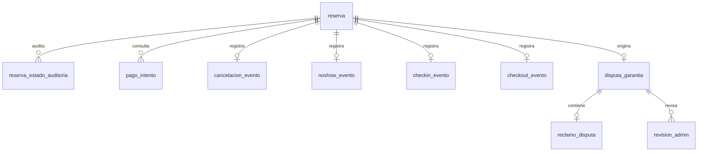

# Implementation Plan: Módulo 2 — Operación de Reservas, Tiempos y Cancelaciones (SEA-SHARE)

**Date**: 2026-09-27 · **Revisión**: 2026-10-10
**Spec**: [`features/CU-01..CU-21/spec.md`](features/) — **única fuente de verdad**. [`context/sea-share.md`](../context/sea-share.md) y [`context/consistencia-m2-m3.md`](../context/consistencia-m2-m3.md) son referencia secundaria; ante discrepancia prevalece el spec.
**Contratos**: [`contracts/`](contracts/README.md) — un archivo `.md` por contrato (REST expuesto, eventos publicados e integraciones externas consumidas).
**Alcance**: Plan **general** del módulo backend. Los planes técnicos detallados de cada caso de uso se redactarán en una tarea posterior, uno por CU.

## Summary

Este plan define la estrategia de construcción del **Módulo 2** de SEA-SHARE: un servicio backend en **Java 21 + Spring Boot 3.5**, empaquetado con **Maven**, que usa **RabbitMQ** como broker de mensajería para la integración asíncrona y la entrega garantizada de eventos hacia el Módulo 3 ("el sistema").

El módulo es dueño del **ciclo de vida de la reserva** (21 casos de uso: CU-01 a CU-18 operativos y CU-19 a CU-21 de vista de consulta) y se integra con dos sistemas externos mediante contratos de API: **Módulo 1** (Gestión de Flota y Activos P2P) como fuente de verdad de la flota y **Módulo 3** (Liquidación, Seguros y Dispersión de Fondos) como autoridad única en todo cálculo monetario.

Dos restricciones del contexto gobiernan toda la arquitectura:

1. **Regla de negocio estricta "Sin dinero"** (FR-010 de CU-08, FR-002 de CU-11 y CU-12, FR-013 de CU-04): Módulo 2 **jamás** calcula, suma, redondea, retiene ni convierte importes monetarios. Todo monto proviene de Módulo 3. Esta regla es la razón de ser de la separación entre los adaptadores de lectura financiera y el dominio de reservas.
2. **Módulo 1 es la única fuente de verdad de la flota**: Módulo 2 no accede a su base de datos, no cachea sus datos técnicos (nombre, tipo, puerto, servicios); solo persiste los identificadores (`embarcacion_id`, `propietario_id`) como referencia, cf. CU-09 Edge Case y CU-20 FR-002. La enunciación de "cero (0) accesos directos a la base de datos de Módulo 1" en CU-09 y CU-10 es un requisito arquitectónico, no una sugerencia.

La consecuencia de diseño es una **arquitectura hexagonal con un único escritor de estado**: CU-08 (`Actualizar estado de reserva`) es la única vía por la que cambia el estado de una reserva, lo que permite un control de concurrencia y una auditoría centralizados, y convierte a la reserva en el *aggregate root* del módulo.

El código se organiza en **dos contextos acotados** (`reservas` y `disputa`) más un paquete **`shared` transversal**. La **comunicación entre los dos contextos** se declara en `shared/contracts` (solo interfaces, comandos y DTOs): `reservas` invoca `disputa` a través del contrato `shared/contracts/dispute/OpenDisputeUseCase` y ninguno de los dos conoce la estructura interna del otro (inversión de dependencia). `shared` se limita a esa frontera y a los tipos de dominio comunes; la plomería técnica (web, seguridad, mensajería, persistencia, observabilidad) **no** se modela dentro de `shared`. Los identificadores de código y de API se escriben en **inglés**; la documentación se mantiene en español (§ Lenguaje ubicuo).

## Technical Context

**Language/Version**: Java 21 (LTS)

**Primary Dependencies**: Spring Boot 3.5.x · Spring Web · Spring Validation · Spring Data JPA · Spring Security (OAuth2 Resource Server) · Spring AMQP (`spring-boot-starter-amqp`, cliente RabbitMQ) · Spring Actuator · Micrometer (Prometheus) · Flyway (migraciones versionadas) · Resilience4j (timeouts, reintentos y circuit breaker de clientes externos) · ShedLock (lock de jobs en despliegues multi-réplica) · springdoc-openapi (contratos de API) · ArchUnit (reglas de arquitectura y de la regla "Sin dinero")

**Storage**: **PostgreSQL 16** con claves primarias `UUID` (vía `gen_random_uuid()`), columnas de timestamp con zona horaria (`timestamptz`), *optimistic locking* con columna de versión (CU-08 FR-006), bloqueo pesimista de filas `SELECT … FOR UPDATE` donde lo exija la atomicidad (CU-03), y **migraciones versionadas con Flyway** (el esquema de `reserva` y `disputa_garantia` es estructura de datos propia, no un esquema heredado). Se eligió por: soporte nativo de `UUID`, `timestamptz`, `@Version`, locks de fila, rango de exclusividad `EXCLUDE`/`btree_gist` para duplicados de `(embarcación, fechas)` si se requiere, y soporte maduro en Flyway y Testcontainers.

**Testing**: JUnit 5 · AssertJ · Mockito · Spring Boot Test · Testcontainers (broker RabbitMQ y base de datos, para tests de integración reales) · WireMock (dobles de contrato de Módulo 1 y Módulo 3) · Awaitility (esperas asíncronas de jobs y mensajes) · ArchUnit (reglas de arquitectura)

**Target Platform**: Linux server, JVM 21, despliegue en contenedor

**Project Type**: Backend REST + worker de mensajería. Servicio único que expone API HTTP y publica y consume mensajes RabbitMQ.

**Performance Goals** (consolidados de los `SC` de los specs; nótese la inconsistencia entre ellos):

| Objetivo | Fuente |
| :--- | :--- |
| Consultas a Módulo 1 (`Consultar información de embarcación`, estado operativo) < 300 ms | SC-001 de CU-09 y CU-10 *(confirmado por negocio el 2026-10-07)* |
| Búsqueda en catálogo con cotización en lote < 2000 ms | SC-002 de CU-01 *(confirmado por negocio el 2026-10-07)* |
| Consulta de información de reserva para Módulo 3 < 200 ms | SC-001 de CU-15 |
| Notificaciones a APIs externas tras consolidar el cambio < 500 ms | SC-002 de CU-08 y CU-14 |
| Notificaciones de Módulo 1 / Módulo 3 en < 1 s (cancelación, inasistencia, check-in, check-out, confirmación de pago) | SC-005 de CU-04, SC-004 de CU-05, SC-002 de CU-06 y CU-07, SC-001 de CU-13 |
| Lote e individual de cotización, y liquidación final | **NEEDS CLARIFICATION** — CU-11 y CU-12 dejan los SLA como placeholders ("p. ej. 800 ms", "p. ej. 1500 ms") |

**Constraints**:

- **Cero aritmética monetaria en el código de Módulo 2** (SC-003 de CU-02, SC-003 de CU-03, SC-007 de CU-04, SC-001 de CU-12, FR-010 de CU-08). Los importes se transportan como `BigDecimal` opacos devueltos por Módulo 3.
- **Cero sobreventa ante pagos concurrentes** (SC-002 de CU-03) y cero eventos perdidos silenciosamente (SC-006 de CU-04). Esto obliga a un patrón transaccional de tipo *outbox*: la transición de estado y el evento saliente deben confirmarse juntos.
- **Fail-safe ante fallo de dependencia externa**: hacia Módulo 1 se admite como máximo un (1) reintento rápido ante timeout o desconexión transitoria; si el reintento también falla, el 100% de los fallos de conexión producen rechazo preventivo, no una decisión optimista (FR-008 de CU-09, FR-006 de CU-10). Módulo 1 y Módulo 3 nunca se consultan por vía alternativa, ni caché ni base de datos.
- **Cero montos ni cálculos de dinero en los mensajes** hacia Módulo 3: ni en `Recibir estado de reserva` (SC-003 de CU-14) ni en `Recibir información de disputa de garantía` (FR-003 y SC-002 de CU-18).
- **Idempotencia obligatoria**: en la **entrada**, CU-13 FR-007 (clave idempotente por par `(id_transaccion_externo, resultado)`), y CU-16 y CU-18 (identificador único por transición de disputa para deduplicación del lado de Módulo 3); en la **salida**, CU-08 FR-011 y CU-14 portan un `eventId` único por transición (patrón outbox) para que Módulo 3 deduplique los eventos.
- **Evaluación de ventanas temporales siempre en la zona horaria del puerto de atraque** obtenida de Módulo 1, nunca en hora de servidor ni de dispositivo (FR-004 de CU-04 y CU-05; CU-09 US2). Si Módulo 1 no resuelve la zona horaria, la operación se detiene y se devuelve indisponibilidad de servicio: no existe zona horaria por defecto.
- **La integración con Módulo 1 es exclusivamente por API** (FR-007 de CU-10). Módulo 2 no implementa el inventario físico.
- **Atribución de términos** según `consistencia-m2-m3.md` §1: se usa **Arrendatario** y **Propietario** (nunca "turista" ni "anfitrión"), **"el sistema"** para Módulo 3 (nunca "Módulo 3" dentro del vocabulario de SPEC/Finanzas) y **"Sistema de Reservas y Operaciones"** para Módulo 2 en las interacciones con Finanzas.

**Scale/Scope**: 1 servicio · 21 casos de uso · 2 contextos acotados (Reservas, Disputa de Garantía) · 2 sistemas externos · 7 interacciones formalizadas (tabla §5 de `consistencia-m2-m3.md`) · Volumen de diseño asumido por el equipo *(a validar con negocio)*: **5.000 usuarios activos/mes · 200 reservas/día · 50 reservas concurrentes en pico · 20 RPS en el pico**.

### Decisiones arquitectónicas transversales

**1. Hexagonal con un único escritor de estado.** El dominio de reservas no depende de Spring Web, JPA ni AMQP. Los casos de uso de UI (CU-01 a CU-07), el webhook de Módulo 3 (CU-13) y los temporizadores (TTL de 15 min, ventana de 24 h) convergen todos en CU-08, que es el *único* mutador del estado de la reserva (FR-001). Esto hace la máquina de estados verificable mediante tests unitarios exhaustivos, sin necesidad de contenedor.

**2. Outbox transaccional + RabbitMQ para toda notificación saliente.** El contexto exige "0% de eventos perdidos" (edge case de CU-08, SC-001 de CU-14, FR-005 de CU-18: "reintenta hasta confirmarla en el broker"). Un *fire-and-forget* no lo garantiza. Se usa un patrón *outbox*: la transición de estado y el registro del evento se escriben en la misma transacción local; un *relay* scheduler publica en RabbitMQ con *publisher confirms* y marca el evento como confirmado solo tras el *ack* del broker. Esto resuelve además un problema de consistencia que los specs no abordan: Módulo 1 no participa de la transacción local, por lo que una transición confirmada puede quedar sin su notificación a Módulo 1 y sin posibilidad de *rollback*. El outbox convierte esa divergencia en un evento reintentable en lugar de una pérdida silenciosa.

**3. Topología RabbitMQ.** Exchange de tipo `topic` para la integración con Módulo 3 (enrutamiento flexible por tipo de evento: `reserva.estado.cambio`, `disputa.estado.cambio`); colas con *dead letter*; *manual ack* en todos los consumidores; reintentos con *backoff* progresivo antes de derivar a la DLQ. Parámetros de reintento fijados para CU-08 y CU-14: máximo 5 intentos (primer intento inmediato), backoff exponencial con jitter de 1 s, 5 s, 25 s y 125 s, solo ante 5xx/timeout y derivación a DLQ con alerta tras el quinto fallo. La retención, los tópicos, el *partitioning* y las garantías de orden de la cola de disputas (CU-18) siguen diferidos al contrato de integración (ver *Riesgos*).

**4. Reloj inyectable y zona horaria por puerto.** Todas las ventanas (15 min de TTL, 72 h y 24 h de cancelación, 30 min de inasistencia, 24 h de disputa) se evalúan contra un `Clock` inyectado y contra el `ZoneId` del puerto devuelto por Módulo 1. Esto hace deterministas los tests de *border* (exactamente 72 h, exactamente 24 h, exactamente 30 min), que los specs exigen explícitamente.

**5. Temporizadores durables, no en memoria.** El TTL de 15 min y el cierre automático de la disputa a las 24 h deben sobrevivir a un reinicio. Por eso se modelan como columnas de vencimiento (`timestamptz`) consultadas por un job `@Scheduled` de barrido en **PostgreSQL 16**, y no como `ScheduledExecutorService`.

**6. Seguridad por roles y por identidad de servicio.** Tres roles de negocio: **Arrendatario**, **Propietario** (debe ser el propietario registrado de la embarcación de esa reserva) y **Admin** (exclusivo de CU-17, que "no introduce montos ni ejecuta operaciones de pasarela"). Módulo 3 entra como identidad de servicio para CU-13 y CU-15. **NEEDS CLARIFICATION**: los specs no especifican mecanismo de autenticación, modelo de tokens, TLS, manejo de PII, *rate limiting* ni protección del log de auditoría. Bloqueante para la Fase 2.

**7. Trazabilidad.** CU-09 FR-010 y CU-10 FR-009 exigen registrar cada consulta externa; CU-15 expone datos históricos. Se usa logging estructurado con *correlation id* propagado en headers HTTP y en headers AMQP.

**8. Fuera de alcance: la UI.** Varios specs contienen requisitos de presentación (por ejemplo FR-009 a FR-013 de CU-03: imagen de portada, *countdown*, banner de advertencia, checkbox de política de cancelación). Este plan cubre **solo el backend**; esos requisitos se entregarán como contrato de API y su implementación visual corresponde a un cliente externo.

## Project Structure

### Documentation (this feature)

```text
Documentación/
├── plan.md                    # Este archivo — Plan general del Módulo 2
├── context/                   # Solo lectura — no modificar
│   ├── sea-share.md
│   └── consistencia-m2-m3.md
├── features/                  # Solo lectura en esta tarea — planes por CU luego
│   └── CU-01..CU-21/
│       ├── spec.md            # (existente)
│       └── plan.md            # (se creará en la tarea posterior, un archivo por CU)
├── diagrams/                  # Solo lectura
└── templates/                 # Solo lectura
```

### Source Code (repository root)

Estructura **por contexto acotado**, y dentro de cada uno por capa hexagonal (`domain` → `application` → `infrastructure`), con un paquete `shared` que solo contiene los contratos entre contextos y los tipos de dominio compartidos. Se elige esta opción porque los 21 CUs se reparten de forma natural en dos contextos con máquinas de estado propias (Reservas y Disputa de Garantía), y porque los specs describen fronteras estrictas ("API externa", "sin acceso directo a BD", "sin cálculos de dinero") que la estructura debe hacer explícitas.

```text
SeaShare-modulo-2/
├── pom.xml
├── Dockerfile
├── docker-compose.yml              # RabbitMQ + PostgreSQL 16
├── .gitignore
├── README.md
│
├── src/main/java/com/seashare/m2/
│   ├── M2Application.java
│   │
│   ├── shared/                                     # Transversal a los dos contextos (Fase 2)
│   │   ├── contracts/           # Fronteras ENTRE contextos: SOLO interfaces, comandos y DTOs
│   │   │   └── dispute/         # OpenDisputeUseCase (lo implementa disputa), OpenDisputeCommand
│   │   └── domain/              # Tipos compartidos puros: DomainException, ClockPort, Money (opaco, sin aritmética)
│   │
│   ├── reservas/                                  # Contexto: Reservas — CU-01 a CU-15, CU-19 a CU-21
│   │   ├── domain/
│   │   │   ├── model/           # Reservation, ReservationStatus, CancellationSubStatus,
│   │   │   │                     # StatusAudit, CheckInEvent, CheckOutEvent, CancellationEvent, NoShowEvent
│   │   │   ├── valueobject/     # ReservationId, BoatId, OwnerId, RenterId, IdempotencyKey, Money (opaco, sin aritmética)
│   │   │   ├── state/           # StateMachine, ValidTransition  (CU-08)
│   │   │   ├── service/         # CancellationClassifier, NoShowWindowPolicy, TtlPolicy  (sin dinero)
│   │   │   └── event/           # Eventos de dominio de la reserva
│   │   ├── application/
│   │   │   ├── port/in/         # Puertos de entrada (uno por CU)
│   │   │   ├── port/out/        # Puertos de salida: repositorios, Módulo 1, Módulo 3, reloj, outbox
│   │   │   ├── dto/             # Commands y results de aplicación
│   │   │   └── service/         # Implementación de los casos de uso
│   │   └── infrastructure/
│   │       ├── adapter/in/web/        # Controllers REST        (CU-01..07, 13, 15, 19, 20, 21)
│   │       ├── adapter/in/scheduler/  # TtlExpiryJob
│   │       ├── adapter/out/fleet/     # Cliente HTTP de Módulo 1   (CU-09, 10)
│   │       ├── adapter/out/finance/   # Cliente HTTP de Módulo 3   (CU-11, 12)
│   │       ├── adapter/out/messaging/ # Outbox, relay y publicadores AMQP   (CU-14)
│   │       └── adapter/out/persistence/ # Entidades JPA, repositorios, mappers
│   │
│   └── disputa/                                   # Contexto: Disputa de Garantía — CU-16 a CU-18
│       ├── domain/
│       │   ├── model/           # GuaranteeDispute, DisputeClaim, AdminReview
│       │   ├── valueobject/     # DisputeId, ClaimWindow, enums de estado
│       │   ├── state/           # StateMachine de la disputa  (CU-17)
│       │   └── event/           # DisputeEvent
│       ├── application/
│       │   ├── port/in/         # Implementa shared.contracts.dispute.OpenDisputeUseCase; NewClaimUseCase; UpdateDisputeStatusUseCase
│       │   ├── port/out/        # DisputaRepository, outbox, publicación (CU-18)
│       │   ├── dto/
│       │   └── service/
│       └── infrastructure/
│           ├── adapter/in/web/        # Controller de reclamo y de decisión Admin
│           ├── adapter/in/scheduler/  # Job de cierre automático de la ventana de 24 h
│           ├── adapter/out/messaging/ # Publicador AMQP de la disputa  (CU-18)
│           └── adapter/out/persistence/ # Repositorio de disputas
│
├── src/main/resources/
│   ├── application.yml
│   ├── application-dev.yml
│   ├── application-test.yml
│   └── db/migration/            # Migraciones versionadas (Flyway / Liquibase)
│
└── src/test/java/com/seashare/m2/
    ├── shared/                  # Fixtures, bases de pruebas, Testcontainers compartidas
    ├── reservas/
    │   ├── domain/              # Tests unitarios de la matriz de estados y de las políticas
    │   ├── contract/            # Tests de contrato contra los dobles de Módulo 1 / Módulo 3
    │   ├── integration/         # Tests de integración (persistencia + outbox + RabbitMQ)
    │   └── web/                 # Tests de endpoint (MockMvc / WebTestClient)
    └── disputa/                 # Mismo desglose que reservas/
```

**Structure Decision**: proyecto único (opción por defecto, sin frontend), organizado en **dos contextos acotados** — `reservas` y `disputa` — porque cada uno posee su propia máquina de estados, sus entidades y sus invariantes, y comparten solo los contratos y tipos de dominio de `shared/`. Dentro de cada contexto se aplica *ports & adapters*: `domain/` sin dependencias de framework, `application/` con los puertos de entrada y salida, e `infrastructure/` con los adaptadores concretos (REST, HTTP saliente, RabbitMQ, JPA, schedulers). La frontera entre `domain` y el resto es lo que hace verificables por tests unitarios la regla "Sin dinero" y la matriz de transiciones de CU-08. El nombre del paquete raíz sigue el proyecto IntelliJ existente, `SeaShare-modulo-2`.

La carpeta `shared/` se limita a la comunicación entre contextos y a los tipos comunes; **no** es una bolsa plana ni contiene plomería técnica:
- `shared/contracts/` define **únicamente** las fronteras entre los dos contextos (interfaces, comandos y DTOs). Aquí vive `dispute/OpenDisputeUseCase`, que `disputa` implementa y `reservas` consume: es el punto donde "se comunican los módulos internos", sin que ninguno dependa concretamente del otro.
- `shared/domain/` contiene tipos compartidos puros (`DomainException`, `ClockPort`, `Money` opaco).

Los adaptadores de cada contexto se separan en `infrastructure/adapter/in` (entrada: web, scheduler) y `infrastructure/adapter/out` (salida: fleet, finance, messaging, persistence), lo que evita colisiones de nombres (p. ej. `web`) y deja explícita la dirección de cada adaptador para las reglas de ArchUnit.

`shared/` debe permanecer **delgado y estable**: solo contratos y tipos de dominio, nunca lógica, framework ni acceso a datos. La plomería técnica (web, seguridad, mensajería, persistencia, observabilidad) **no se modela** como parte de `shared/`.

## Modelo de datos (PostgreSQL)

Convenciones: UUID v4; `timestamptz`; montos `NUMERIC(18,4)` (solo almacenados literalmente, nunca operados); migraciones Flyway; `version` para *optimistic locking*.

| Tabla | Tipo | Columnas relevantes | Restricciones |
|---|---|---|---|
| `reserva` | Entidad (CU-02/03/08) | `id`, `codigo_reserva`, `arrendatario_id`, `embarcacion_id`, `propietario_id`, `estado`, `sub_estado`, `fecha_inicio`, `fecha_fin`, `hora_inicio` [I1], `pasajeros`, `titular_nombre`, `titular_celular`, `titular_email`, `estimado_total`, `monto_alquiler`, `monto_seguro`, `monto_deposito`, `monto_total` (nulos hasta Pendiente de Pago), `moneda` (COP), `ttl_expira_en`, `salida_real`, `llegada_real`, `novedades_cierre`, `referencia_externa_pago`, `confirmado_pago_en`, `creado_en`, `actualizado_en`, `version` | `CHECK (fecha_fin >= fecha_inicio)`; `CHECK (pasajeros > 0)`; **sin** `UNIQUE(embarcacion_id, fechas)` (varias Iniciada coexisten); índices `(arrendatario_id, creado_en DESC)`, `(propietario_id, creado_en DESC)`, `(estado, ttl_expira_en)` |
| `reserva_estado_auditoria` | Inmutable | `id`, `reserva_id`, `estado_anterior`, `estado_nuevo`, `sub_estado`, `actor`, `motivo`, `ocurrido_en` | FK; trigger anti-`UPDATE`/`DELETE` |
| `pago_intento` | Entidad (CU-13) | `id`, `reserva_id`, `resultado`, `detalle`, `referencia_externa`, `consultado_en` | FK; índice `(reserva_id, consultado_en DESC)` |
| `cancelacion_evento` | Inmutable (CU-04) | `id`, `reserva_id`, `actor`, `solicitado_en`, `anticipacion_horas`, `sub_estado`, `motivo`, `justificacion` | FK; unicidad por reserva |
| `noshow_evento` | Inmutable (CU-05) | `id`, `reserva_id`, `propietario_id`, `reportado_en`, `minutos_espera`, `observaciones` | FK; unicidad por reserva |
| `checkin_evento` / `checkout_evento` | Inmutables (CU-06/07) | `id`, `reserva_id`, `propietario_id`, `hora_real`, `notas`/`novedades` | FK; unicidad por reserva |
| `consulta_externa_log` | Técnica (CU-09/10) | `id`, `tipo`, `embarcacion_id`, `resultado`, `correlation_id`, `consultado_en` | Sin datos técnicos de la flota |
| `disputa_garantia` | Entidad (CU-16/17) | `id`, `reserva_id`, `estado`, `ventana_inicio`, `ventana_fin`, `tiene_reclamo`, `motivo`, `resuelto_por`, `resuelto_en`, `version` | `UNIQUE(reserva_id)`; `CHECK` de estados; finales inmutables |
| `reclamo_disputa` | Entidad (CU-16) | `id`, `disputa_id`, `propietario_id`, `descripcion`, `categoria`, `evidencias_urls`, `registrado_en` | `UNIQUE(disputa_id)` [D-01 CU-16] |
| `revision_admin` | Entidad (CU-17) | `id`, `disputa_id`, `admin_id`, `decision`, `motivo`, `notas_internas`, `revisado_en` | FK |
| `outbox_message` | Técnica | `id`, `event_id`, `destino` (`AMQP` \| `M1_HTTP`), `exchange`, `routing_key`, `payload`, `created_at`, `published_at`, `attempts`, `next_attempt_at` | Índice parcial `published_at IS NULL`; el `payload` con token se purga al confirmar |
| `operational_failure` | Técnica | `id`, `use_case`, `reserva_id`, `reason`, `payload_ref`, `created_at`, `resolved` | Aprobaciones tardías, DLQ agotada, inconsistencias |
| `idempotency_key` | Técnica | `key`, `endpoint`, `response_ref`, `created_at` | `UNIQUE(key, endpoint)`; ventana de 60 s |
| `shedlock` | Técnica | Bloqueo de jobs | — |

**No existen en Módulo 2**: tablas de embarcaciones, tarifas, parámetros financieros, cobros, reembolsos ni liquidaciones.

### Diagrama Entidad-Relación



---

## Conexiones con otros módulos y mensajería (RabbitMQ)

Exchange común hacia Módulo 3: `seashare.reservations` (topic, durable); topología y nombres adoptados de Módulo 3 (D-17).

| # | Origen → Destino | CU | Estilo | Transporte | Contrato |
|---|---|---|---|---|---|
| C1 | M2 → M1 | CU-01, CU-19 | Request/response | `GET /api/v1/embarcaciones[/{id}]` | m1-consultar-informacion-embarcacion |
| C2 | M2 → M1 | CU-02, CU-03 | Request/response | `GET …/estado-operativo` | m1-consultar-estado-operativo |
| C3 | M2 → M1 | CU-08 | Comando idempotente | Outbox → `PUT …/estado-operativo` | m1-asignar-estado-operativo |
| C4 | M2 → M3 | CU-11 | Request/response | `POST /api/v1/estimates/batch` y `/individual` | m3-estimacion-lote / individual |
| C5 | M2 → M3 | CU-12 | Request/response | `POST …/calculated-value` | m3-calculo-total |
| C6 | **M3 → M2** | CU-13 | Endpoint expuesto (webhook) | `POST /reservas/{id}/pago/confirmacion` | rest/CU-13-confirmar-pago |
| C7 | **M3 → M2** | CU-15 | Endpoint expuesto (lectura) | `GET /api/v1/internal/reservas/{id}` | rest/CU-15-solicitar-informacion-reserva |
| C8 | M2 → M3 | CU-14 | Evento AMQP | `reservation.status.changed` → `finance.reservation-status.v1` | event/CU-14 |
| C9 | M2 → M3 | CU-18 | Evento AMQP | `reservation.dispute.updated` → `finance.guarantee-dispute.v1` | event/CU-18 |
| C10 | Usuarios → M2 | CU-01…07, 16, 17, 19…21 | Request/response (REST) | — | rest/ |
| C11 | M2 → M2 | CU-08, TTL, disputa | Jobs programados | ShedLock | §Jobs |

**Jobs internos** (con ShedLock en multi-réplica): `TtlExpiryJob` (CU-08), `DisputeWindowCloseJob` (CU-16/17), `OutboxRelayJob` (infra; AMQP con publisher confirms y `PUT` a M1; backoff 1/5/25/125 s; 5 intentos → DLQ + alerta). Módulo 2 es dueño de **todos** sus temporizadores de negocio (TTL, ventana de 24 h, tolerancia de 30 min), modelados como columnas de vencimiento durables, no como `ScheduledExecutorService`.

> **Dirección CU-13 / CU-15 (decisión de revisión)**: se **mantiene lo que dicen los `spec.md` vigentes** — Módulo 3 **llama** a Módulo 2 para confirmar pago (CU-13, FR-001) y para consultar la información de reserva (CU-15, FR-001). No se invierte a la dirección M2 → M3 propuesta en la revisión del 2026-10-10; ese cambio queda como punto abierto (§ Riesgos).

---

## Contratos

Cada contrato vive en su archivo en [`contracts/`](contracts/), con leyenda `[SPEC]/[CONV]/[PEND]`, sobre de error común y tabla de decisión de errores adaptada de Módulo 3.

| Tipo | Contratos | Quién → quién |
|---|---|---|
| REST expuesto | CU-01…07, **13**, **15**, 16, 17, 19, 20, 21 | Usuarios / Módulo 3 → M2 |
| Evento publicado | CU-14, CU-18 | M2 → M3 (unidireccional) |
| Externo consumido (M1) | información de embarcación, estado operativo, asignar estado operativo | M2 → M1 |
| Externo consumido (M3) | estimación lote, estimación individual, cálculo total | M2 → M3 |
| Interno | CU-08 | Casos de uso → CU-08 |
| Interno entre contextos | `shared/contracts/dispute/OpenDisputeUseCase` | reservas → disputa |

**Códigos de error**: se adopta la tabla de decisión E1–E10 de Módulo 3 (Problem Details RFC 9457 con `code` y `retryable`; 4xx = el llamador puede corregir; 5xx = falla propia o de dependencia). Especificidades de Módulo 2: `409` para conflictos de estado y concurrencia (`INVALID_RESERVATION_STATE`, `CONCURRENT_STATE_CHANGE`, `RESERVA_EXPIRADA`, `EMBARCACION_NO_APTA`); `503` para M1/M3 caídos.

**Entrega y verificación**: tests de contrato con los ejemplos de cada `.md` (MockMvc para REST; cuerpo AMQP contra el esquema; WireMock para M1 y M3) y verificación cruzada con los contratos de Módulo 3 antes de cada hito.

---

## Resiliencia (valores iniciales a calibrar)

| Dependencia | Timeout | Reintentos | Otros |
|---|---|---|---|
| Módulo 1 (lecturas) | connect 100 ms / read 300 ms | 1 rápido, nunca ante 4xx | Fail-safe: no apto / 503 |
| Módulo 1 (PUT estado) | connect 100 ms / read 300 ms | Outbox, 5 intentos con backoff | DLQ + alerta |
| Módulo 3 (estimación lote) | read 1000 ms | 0 | Degradación del catálogo |
| Módulo 3 (individual, cálculo total) | read 1000 ms | 0–1 si cabe en el presupuesto | Aborta sin transicionar |
| RabbitMQ (publicación) | publisher confirm | 5 intentos, 1/5/25/125 s con jitter | DLQ + alerta |

---

## Decisiones de diseño y justificación

| ID | Decisión | Alternativas descartadas | Justificación | CU |
|---|---|---|---|---|
| D-01 | **Un solo servicio desplegable** con dos contextos internos | Microservicio por contexto | Un único escritor de estado y outbox transaccional comparten BD | Todos |
| D-02 | **Dos contextos (`reservas`, `disputa`)** con hexagonal y ArchUnit en CI | Un solo dominio | Dos máquinas de estado independientes sin transiciones cruzadas | Todos |
| D-03 | **Comunicación interna vía `shared/contracts`** (inversión de dependencia) | `reservas` importando `disputa.application.port.in` | Ninguno de los dos contextos conoce la estructura interna del otro | 07, 16 |
| D-04 | **`shared` solo con contratos y tipos de dominio** | Un `shared` que incluye la plomería técnica (web, seguridad, mensajería, persistencia, observabilidad) | Se mantiene delgada la frontera entre contextos y se evita el cajón de sastre | Todos |
| D-05 | **Módulo 3 llama a Módulo 2** para CU-13 (webhook) y CU-15 (GET) | Invertir a M2 → M3 | Es lo que fijan los specs vigentes | 13, 15 |
| D-06 | **CU-08 único escritor de estado** | Cada CU transiciona su estado | Concurrencia y auditoría centralizadas | 01–08, 13 |
| D-07 | **Outbox transaccional + relay** para AMQP y para PUT a M1 | Fire-and-forget; llamada síncrona en la transacción | M1 no participa de la transacción local | 08, 14, 18 |
| D-08 | **Idempotencia de entrada** por clave `(id_transaccion_externo, resultado)` y dedup saliente por `event_id` | Confiar en *at-least-once* | FR-007 de CU-13 y FR-011 de CU-08 | 08, 13 |
| D-09 | **Token de pago efímero**: se recibe en CU-03, viaja y se purga del outbox | Persistirlo en `reserva` | Minimización de datos sensibles | 03, 14 |
| D-10 | **CU-03 en dos pasos** (resumen, luego pago) | Una sola llamada que calcula y transiciona | El Arrendatario ve y acepta el desglose antes del bloqueo | 03, 12 |
| D-11 | **Cálculo de CU-12 y M3 fuera del lock**; lock solo para CU-10 + transición | Llamar a M3 con lock de fila | No retener locks durante una llamada externa lenta | 03 |
| D-12 | **Importes como `BigDecimal` desde *string*, sin aritmética** (ArchUnit lo verifica) | `double`; cálculos "de presentación" | Regla "Sin dinero" verificable | Todos |
| D-13 | **Moneda COP fijada por contrato** hasta que M3 devuelva `currency` | Asumir por usuario | M3 no la envía en lote ni en cálculo | 01, 11, 12 |
| D-14 | **Cero caché y cero copia** de datos de Módulo 1 | Caché con TTL de fichas | Consistencia con CU-09/CU-10 | 01, 09, 10, 19 |
| D-15 | **Temporizadores durables en BD** con jobs + ShedLock | `ScheduledExecutorService` | Sobreviven a reinicios y a varias réplicas | 08, 16, 17 |
| D-16 | **`Clock` inyectable y zona del puerto** | Hora de servidor | Bordes exactos verificables (72 h, 24 h, 30 min, 900 s) | 04, 05, 06 |
| D-17 | **Topología y nombres de colas adoptados de Módulo 3** (`seashare.reservations`) | Topología propia | El consumidor ya la definió | 14, 18 |
| D-18 | **Lock pesimista en CU-03** + `@Version` en CU-08 y disputa | Solo optimista; serializable | FCFS atómico; sin sobreventa | 03, 08, 17 |
| D-19 | **Estados terminales inmutables** (triggers anti-mutación) | Convención en código | Trazabilidad | 04–08, 17 |
| D-20 | **Códigos de error E1–E10 de Módulo 3** | Catálogo propio | Respuestas coherentes en todo SEA-SHARE | Todos |
| D-21 | **Resilience4j** (timeout, reintento, circuit breaker) configurable | Reintentos manuales | Evita cargas infinitas | 01, 09–12 |
| D-22 | **JWT con roles; `sub` desde la identidad** | IDs en el cuerpo | Aislamiento de datos | 04–07, 16, 17, 20, 21 |
| D-23 | **Código y API en inglés**; documentación en español | Identificadores en español | Alinea con Módulo 3 | Todos |
| D-24 | **Estructura `adapter/in` y `adapter/out`** dentro de `infrastructure` | Carpetas `web`, `client`, `persistence` sueltas | Dirección explícita de cada adaptador; facilita ArchUnit y elimina colisiones de nombre | Todos |

---

## Lenguaje ubicuo (spec → código)

| Término del spec | Identificador en código |
|---|---|
| Reserva / Iniciada, Pendiente de Pago, Reservada, En Navegación, Completada, Cancelada, Expirada, Pago Fallido | `Reservation` / `INITIATED`, `PENDING_PAYMENT`, `RESERVED`, `IN_NAVIGATION`, `COMPLETED`, `CANCELLED`, `EXPIRED`, `PAYMENT_FAILED` |
| Sub-estados: Flexible, Moderado, Tardío, Por Propietario, Por Inasistencia | `FLEXIBLE`, `MODERATE`, `LATE`, `BY_OWNER`, `NO_SHOW` |
| Disputa de garantía / PENDIENTE, RECHAZADA, ACEPTADA | `GuaranteeDispute` / `PENDING`, `REJECTED`, `ACCEPTED` |
| Arrendatario / Propietario / Admin | `Renter` / `Owner` / `Admin` |
| Notificación de estado / estado de reserva | `ReservationStatusEvent` |
| Embarcación (de Módulo 1) | `Boat` (solo `boatId` persistido) |
| Puerto / zona horaria | `Harbor` / `ZoneId` (nunca persistido) |
| Contrato interno de apertura de disputa | `shared.contracts.dispute.OpenDisputeUseCase` |

---

## Phase 1: Setup (Shared Infrastructure)

**Purpose**: Inicialización del repositorio Spring Boot y de la estructura base del proyecto.

- [ ] T001 Inicializar el repositorio Maven con `spring-boot-starter-parent` 3.5.x y `java.version` 21
- [ ] T002 Declarar en `pom.xml` las dependencias base: `spring-boot-starter-web`, `-validation`, `-data-jpa`, `-security`, `-amqp`, `-actuator`, `springdoc-openapi`, `resilience4j-spring-boot3` y el driver `postgresql`
- [ ] T003 Configurar el build: `maven-compiler-plugin` (release 21), `maven-surefire-plugin` (tests unitarios), `maven-failsafe-plugin` (tests de integración) y `spring-boot-maven-plugin`
- [ ] T004 Crear la clase principal `M2Application` con *component scanning* de `com.seashare.m2`
- [ ] T005 Crear el árbol de paquetes de _Project Structure_ (`shared/`, `reservas/`, `disputa/`) y los `package-info.java` que documentan la regla "Sin dinero"
- [ ] T006 Externalizar la configuración en `application.yml` y perfiles `dev` / `test` / `prod` (host, puerto y credenciales de RabbitMQ; *datasource*; timeouts), sin secretos en el repositorio
- [ ] T007 Definir `docker-compose.yml` con RabbitMQ (management habilitado) y `postgres:16`
- [ ] T008 Crear el `Dockerfile` multi-stage para empaquetar el servicio
- [ ] T009 Configurar verificación de estilo y formato (Checkstyle o Spotless) integrada al build
- [ ] T010 Completar `.gitignore` y el `README.md` con la guía de arranque local

---

## Phase 2: Foundational (Blocking Prerequisites)

**Purpose**: Infraestructura crítica que debe existir **antes** de implementar cualquier caso de uso. Los 21 CUs dependen de estos elementos: todos los que cambian estado pasan por la persistencia transaccional y el outbox, todos los que validan ventanas dependen del reloj y de la zona horaria por puerto, y todos los que notifican a Módulo 3 dependen de la topología RabbitMQ.

- [ ] T011 **Manejo global de errores**: jerarquía de excepciones de dominio mapeada a código HTTP y cuerpo de error uniforme; validar que ninguna respuesta de error expone datos sensibles ni *stack traces*
- [ ] T012 **Seguridad**: autenticación y autorización por rol (**Arrendatario**, **Propietario**, **Admin**) más identidad de servicio para Módulo 3 (CU-13 y CU-15); endpoints protegidos por defecto; CORS y TLS. **NEEDS CLARIFICATION**: el mecanismo de autenticación no está definido en los specs
- [ ] T013 **Persistencia**: framework de migraciones versionadas y esquema base; entidad base con *auditing* (`creadoEn`, `actualizadoEn`), clave `UUID` y columna de *optimistic locking* para satisfacer FR-004 y FR-006 de CU-08
- [ ] T014 **Persistencia**: repositorios de `Reservation` y `GuaranteeDispute` con soporte transaccional y de bloqueo pesimista donde la atomicidad lo requiera (adquisición del bloqueo de inventario en CU-03)
- [ ] T015 **RabbitMQ — topología**: exchange de tipo `topic`, colas de integración con Módulo 3, *bindings* por tipo de evento, colas de *dead letter* y política de retención
- [ ] T016 **RabbitMQ — entrega garantizada**: *publisher confirms*, *manual ack* en consumidores, reintentos con *backoff* exponencial con jitter (5 intentos: 1 s, 5 s, 25 s, 125 s; solo ante 5xx/timeout) y derivación a DLQ con alerta tras el quinto fallo
- [ ] T017 **Outbox transaccional**: tabla de salida, escritura conjunta con la transición de estado, *relay* scheduler con confirmación del broker y marcado del evento como entregado
- [ ] T018 **Reloj y zona horaria**: bean `Clock` inyectable y resolución de `ZoneId` a partir del puerto de atraque devuelto por Módulo 1, con *fail-safe* explícito (sin zona horaria por defecto)
- [ ] T019 **Clientes HTTP salientes**: cliente base para Módulo 1 y Módulo 3 con timeouts, un (1) reintento rápido máximo hacia Módulo 1 antes del *fail-safe* y reintentos de cola (según T016) hacia Módulo 3, *circuit breaker*, política *fail-safe* uniforme y propagación de *correlation id*
- [ ] T020 **Contratos de API**: versionado, DTOs de entrada y salida separados del dominio, convención de nombres JSON, `BigDecimal` para importes **opacos sin aritmética**, y especificación OpenAPI
- [ ] T021 **Observabilidad**: *correlation id* en HTTP y AMQP, logging estructurado con MDC, métricas Actuator y *health checks* de RabbitMQ y de la base de datos
- [ ] T022 **Infraestructura de testing**: contenedores Testcontainers para RabbitMQ y base de datos; servidor WireMock con los dobles de Módulo 1 y Módulo 3; base de pruebas reutilizable
- [ ] T023 **Idempotencia**: mecanismo transversal de claves idempotentes de entrada y de deduplicación de eventos salientes (satisface FR-007 de CU-13 y FR-004 de CU-18)
- [ ] T024 **ArchUnit**: reglas de capas y de la regla "Sin dinero": `domain` sin Spring/JPA/AMQP; `application` solo depende de `domain`; `adapter/in` solo invoca `port/in`; `adapter/out` solo implementa `port/out`; `shared/contracts` solo interfaces/DTOs; `reservas` no depende de `disputa` salvo por el contrato de `shared/contracts`

**Checkpoint**: la Fundación está lista — la implementación de los casos de uso puede comenzar en paralelo.

---

## Phase 3: Adaptadores de integración de solo lectura (P1)

**Qué CUs agrupa**: **CU-09** (Proveer información de embarcación), **CU-10** (Brindar información de estado operativo), **CU-11** (Proveer información cotización de reserva), **CU-12** (Brindar cálculo total de la reserva)

**Justificación**: los cuatro son adaptadores **sin máquina de estados, sin persistencia de dominio y sin efectos secundarios**: solo consultan Módulo 1 o Módulo 3 y devuelven el resultado sin transformarlo. Esto los convierte en el punto de entrada natural del proyecto: son verificables de forma aislada contra dobles de prueba, sin depender de ningún otro CU ni de la base de datos, y filtran y condicionan la frontera más delicada del sistema — el límite "sin dinero" y el comportamiento *fail-safe* ante fallos de Módulo 1. Además son **desbloqueantes**: CU-02 y CU-04 dependen de la zona horaria del puerto que entrega CU-09, CU-01 depende del modo lote de CU-11, y CU-03 depende de la liquidación final de CU-12. Empezar por ellos permite avanzar en paralelo con el núcleo de dominio y fija los contratos de integración con Módulo 1 y Módulo 3 antes de construir lógica de negocio encima.

> Las tareas técnicas detalladas de cada CU se definirán en su propio plan específico más adelante.

---

## Phase 4: Núcleo de dominio — máquina de estados de la reserva (P1)

**Qué CUs agrupa**: **CU-08** (Actualizar estado de reserva)

**Justificación**: es la pieza de mayor riesgo técnico y el **cuello de botella de todo el módulo**. FR-001 lo convierte en el único escritor de estado, y ocho componentes dependen de él (`Iniciar reserva`, `Iniciar pago`, `Confirmar pago`, `Marcar inicio de navegación`, `Marcar fin de navegación`, `Solicitar cancelación`, `Marcar inasistencia` y el temporizador del TTL). Concentra los requisitos más exigentes del módulo: matriz de transiciones validada estrictamente, atomicidad de guardado, control de concurrencia, inmutabilidad de los estados terminales, tabla de sincronización con Módulo 1 y con Módulo 3, y el barrido de expiración del TTL de 15 minutos. Debe resolverse antes que cualquier caso de uso que mute estado, porque de lo contrario cada CU construiría su propia lógica de transición y se perdería la garantía de consistencia que el propio spec declara como su propósito. Al ser lógica pura de dominio, se implementa y se verifica sin RabbitMQ ni base de datos.

> Las tareas técnicas detalladas de cada CU se definirán en su propio plan específico más adelante.

---

## Phase 5: Superficie de integración expuesta a Módulo 3 (P1)

**Qué CUs agrupa**: **CU-14** (Recibir estado de reserva), **CU-15** (Solicitar información de la reserva)

**Justificación**: son los dos puntos de contacto que la tabla §5 de `consistencia-m2-m3.md` define desde el lado de Módulo 2, y ambos dependen de la Fase 4 (CU-14 se dispara desde la máquina de estados; CU-15 consulta reservas ya persistidas). Se agrupan porque **comparten la verificación de una misma garantía**: que el módulo expone información operativa exacta, sin montos, sin cálculos y con idempotencia. CU-14 es además la **primera prueba real de la infraestructura de RabbitMQ construida en la Fase 2** (outbox, reintentos, DLQ), de modo que implementarlo aquí valida la Fase 2 antes de que el volumen de mensajes crezca con el resto de casos de uso. Cerrar esta fase completa el contrato de integración con Módulo 3 para el ciclo de la reserva.

> Las tareas técnicas detalladas de cada CU se definirán en su propio plan específico más adelante.

---

## Phase 6: Vistas de consulta — CU-19, CU-20, CU-21 (P1)

**Qué CUs agrupa**: **CU-19** (Ver detalle de embarcación), **CU-20** (Ver mis reservas), **CU-21** (Ver detalle de reserva)

**Justificación**: son los tres casos base de las relaciones `<<extend>>` del conjunto — CU-02 (`Iniciar reserva`) se ancla a CU-19, CU-01 extiende hacia CU-19, CU-04 (`Solicitar cancelación`) y CU-03 (`Iniciar pago`) se anclan a CU-21 (caso base de CU-03 resuelto el 2026-10-07). Los tres son de **solo lectura, sin máquina de estados ni efectos secundarios**: CU-19 consulta Módulo 1 (vía CU-09) y la cotización individual (vía CU-11); CU-20 y CU-21 leen reservas ya persistidas y exponen el detalle sin escrituras, en línea con las restricciones monetarias de CU-15 (exponen el total oficial, cero montos derivados). Se colocan como fase propia **antes del embudo** para que los casos base existan antes que sus extenders y para desbloquear la verificación de las extensiones que comparten los recorridos de las Fases 7 y 8. Dependen de la Fase 2 (persistencia de CU-20/CU-21) y de la Fase 3 (CU-19 requiere la cotización individual y los datos de Módulo 1).

> Las tareas técnicas detalladas de cada CU se definirán en su propio plan específico más adelante.

---

## Phase 7: Embudo de conversión — de la búsqueda al pago confirmado (P1)

**Qué CUs agrupa**: **CU-01** (Buscar embarcaciones disponibles), **CU-02** (Iniciar reserva), **CU-03** (Iniciar pago), **CU-13** (Confirmar pago)

**Justificación**: es la **vertical de mayor valor de negocio** del marketplace (sin ella el producto no genera ingresos) y forma un único recorrido de principio a fin: búsqueda con cotización por lote → creación de la reserva en `Iniciada` con el TTL en curso → adquisición del bloqueo de inventario y paso a `Pendiente de Pago` → confirmación del pago reportada por Módulo 3 y paso a `Reservada`. Se agrupan porque comparten la misma presión de concurrencia y el mismo indicador de negocio: dos Arrendatarios compiten por el mismo barco y las mismas fechas, y el spec exige cero sobreventa y respuesta atómica. Contiene la condición de no-bloqueo en `Iniciada` (varias reservas concurrentes para el mismo barco) y la carrera de sobreventa en `Pendiente de Pago`. Requiere las Fases 3 (contratos de cotización y liquidación), 4 (máquina de estados), 5 (notificación a Módulo 3) y 6 (vistas base de las extensiones CU-02 y CU-03) completas.

> Las tareas técnicas detalladas de cada CU se definirán en su propio plan específico más adelante.

---

## Phase 8: Operaciones en muelle — check-in, check-out, inasistencia y cancelación (P2)

**Qué CUs agrupa**: **CU-06** (Marcar inicio de navegación), **CU-07** (Marcar fin de navegación), **CU-05** (Marcar inasistencia), **CU-04** (Solicitar cancelación)

**Justificación**: los cuatro comparten **actor (Propietario), contexto físico (operación en el muelle) y punto de entrada** sobre una reserva que ya está `Reservada` o `En Navegación`. Dependen de la Fase 4, de la zona horaria del puerto entregada por CU-09 en la Fase 3 y de la Fase 6 (CU-21 es el caso base de `Solicitar cancelación`). Se agrupan y no se distribuyen porque comparten la misma familia de reglas de **ventana temporal y clasificación** (margen de salida, 30 minutos de tolerancia, 72 h y 24 h de cancelación) y porque las transiciones que producen convergen en las mismas ramifications de la máquina de estados. Dentro de la fase el orden sugerido es **check-in → check-out → cancelación → inasistencia**: los dos primeros son el camino feliz y los mejor especificados, mientras que los dos últimos concentran los `[NEEDS CLARIFICATION]` que siguen abiertos (clasificación del motivo del propietario en CU-04) y conviene abordarlos cuando la máquina de estados ya esté probada. El valor de negocio es completar el ciclo operativo del alquiler.

> Las tareas técnicas detalladas de cada CU se definirán en su propio plan específico más adelante.

---

## Phase 9: Disputa de garantía (P2)

**Qué CUs agrupa**: **CU-16** (Generar disputa de garantía), **CU-17** (Actualizar estado de disputa de garantía), **CU-18** (Recibir información de disputa de garantía)

**Justificación**: constituye un **contexto acotado independiente**, con su propia máquina de estados (`PENDIENTE` / `RECHAZADA` / `ACEPTADA`), sus propias entidades y sus propias invariantes, sin ninguna transición sobre la reserva. Solo es alcanzable a través de CU-07 (`Completada`) y puede desarrollarse **en paralelo con la Fase 8** una vez que exista la infraestructura de mensajería de la Fase 2. Se mantiene como fase aparte precisamente para permitir ese paralelismo y para no mezclar dos máquinas de estado en los mismos archivos. Concentra el requisito asíncrono más estricto del módulo: CU-18 publica **solo** en estados finales, **cero mensajes en `PENDIENTE`**, con identificador único para deduplicación, sin ningún monto ni instrucción de pago, y con reintento hasta confirmación del broker. Cierra el ciclo financiero del depósito de garantía.

> Las tareas técnicas detalladas de cada CU se definirán en su propio plan específico más adelante.

---

## Phase 10: Polish & Cross-Cutting Concerns

**Purpose**: Mejoras que afectan a múltiples casos de uso.

- [ ] TXXX Cierre de los `[NEEDS CLARIFICATION]` heredados de los specs y actualización de los planes por CU
- [ ] TXXX Endurecimiento de seguridad: _rate limiting_, protección del log de auditoría, validación de PII
- [ ] TXXX Pruebas de carga y verificación de los objetivos de latencia de la tabla de _Performance Goals_
- [ ] TXXX Observabilidad operativa: alertas por acumulación de mensajes en DLQ, por etapas de reintentos agotados y por fallos de notificación a Módulo 3
- [ ] TXXX Pruebas de resiliencia: caída de Módulo 1, caída de Módulo 3, reinicio del servicio con TTL y ventanas de disputa en curso, y reinicio del broker
- [ ] TXXX Documentación de la API y guía de arranque local
- [ ] TXXX Limpieza de código y refactorización final

---

## Dependencies & Execution Order

### Phase Dependencies

- **Setup (Fase 1)**: sin dependencias — puede comenzar de inmediato
- **Foundational (Fase 2)**: depende de la Fase 1 — **bloquea a todos los CUs**
- **Fase 3 — Adaptadores de lectura**: depende de la Fase 2 (clientes HTTP, manejo de errores). No depende de ninguna otra fase de CU
- **Fase 4 — Máquina de estados**: depende de la Fase 2 (persistencia, outbox, reloj). No depende de la Fase 3
- **Fase 5 — Superficie Módulo 3**: depende de las Fases 2 y 4
- **Fase 6 — Vistas de consulta**: depende de las Fases 2 (persistencia de CU-20/CU-21) y 3 (CU-19: cotización individual y datos de Módulo 1); CU-20 y CU-21 leen reservas gestionadas desde la Fase 4
- **Fase 7 — Embudo de conversión**: depende de las Fases 3, 4, 5 y 6
- **Fase 8 — Operaciones en muelle**: depende de las Fases 3, 4, 5 y 6
- **Fase 9 — Disputa de garantía**: depende de la Fase 2 y del disparo de CU-07 (Fase 8), aunque su núcleo de dominio puede desarrollarse en paralelo con la Fase 8
- **Polish (Fase 10)**: depende de las fases de CU deseadas

### Orden y paralelismo

```text
Fase 1 ──▶ Fase 2 ──┬──▶ Fase 3 (lectura) ──┬──▶ Fase 7 (conversión)
                    │                       │
                    ├──▶ Fase 4 (núcleo) ───┼──▶ Fase 8 (muelle) ──┬──▶ Fase 9 (disputa)
                    │         │             │                      │          ▲
                    │         └──▶ Fase 5 ───┘                      └──────────┘
                    │            (Módulo 3)
                    ├──▶ Fase 6 (vistas) ──▶ Fase 7 / Fase 8
                    └──▶ Fase 9 (dominio, en paralelo)
```

- **Fases 3 y 4** pueden ejecutarse simultáneamente tras completar la Fase 2: no comparten código de dominio.
- **Fase 6 (vistas)** puede ejecutarse en paralelo con las Fases 4 y 5 una vez cerradas las Fases 2 y 3.
- **Fases 7 y 8** pueden ejecutarse en paralelo una vez cerradas las Fases 3, 4, 5 y 6.
- **Fase 9** puede avanzar en paralelo con la Fase 8 si se acuerda el contrato de integración del disparo desde `Completada`.

### Dentro de cada CU

- Modelo de dominio antes que casos de uso; casos de uso antes que adaptadores
- Contrato de Módulo 1 / Módulo 3 definido antes de su adaptador
- Núcleo antes que integración
- Pruebas de la máquina de estados antes de exponer el endpoint
- Las tareas marcadas con `[P]` pueden ser paralelas entre sí dentro de una fase

---

## Riesgos y contradicciones detectadas en los specs

Esta sección **no resuelve** las inconsistencias: las señala para que se cierren antes de escribir el plan técnico del CU afectado.

### B. Vacíos que bloquean la redacción de un plan de CU

1. **Seguridad subespecificada en todo el conjunto de specs**: solo hay chequeos de rol; no existe mecanismo de autenticación, modelo de tokens, TLS, manejo de PII, _rate limiting_ ni protección del log de auditoría. Bloqueante para la Fase 2. *(Decisión diferida por negocio el 2026-10-07; el mecanismo se definirá en la decisión transversal 6 y en T012 antes de la Fase 2.)*
2. CU-11: siguen abiertos el límite de lote de Módulo 3 (50 o 100, repetido en varios FR) y su SLA (placeholder). CU-12: siguen abiertos el nombre formal del endpoint (dos candidatos) y su SLA. Nota: CU-01 FR-008 y CU-11 FR-003 fijaron el tamaño de página de la vista en 20 embarcaciones, que no coincide con el límite por solicitud que impone Módulo 3.
3. CU-16, CU-17 y CU-18: cerrada la duda de la ventana de 24 h (es **fija**; se añadió como SLA en CU-16 FR-005, CU-17 FR-013 y CU-18 FR-007). Siguen abiertos: reclamo múltiple o editable dentro de la ventana (CU-16 D-01), política de reintento del job diferido (CU-16 D-03, ahora con `[NEEDS CLARIFICATION]` en el spec), si el Admin puede resolver una disputa `PENDIENTE` sin reclamo registrado (CU-17 D-01), longitud máxima del motivo (CU-17), y garantías de orden y versionado de `eventId` + detalles de la cola (CU-18 D-01/D-02, diferidos al contrato de integración). *(Dependen del contrato de integración con Módulo 3; sin resolver hasta entonces.)*

### C. Reauditoría 2026-10-08

> **Reauditoría 2026-10-08** contra el conjunto completo de especificaciones (`CU-01` a `CU-21`) y documentos de contexto (`sea-share.md`, `consistencia-m2-m3.md`). Se consolidaron 23 hallazgos: las correcciones mecánicas y decididas fueron aplicadas directamente en los `spec.md` y documentos afectados, mientras que los temas de arquitectura/negocio pendientes de alineación externa se registran como abiertos.

| # | Hallazgo | Alcance / Descripción | Estado |
| :--- | :--- | :--- | :--- |
| **H1** | Chequeo instantáneo vs rango de fechas en catálogo y reserva | Catálogo no valida rango de fechas (fuera de alcance; exclusividad FCFS en pago). CU-02 y CU-03 validan estado operativo instantáneo `Disponible` vía CU-10 bajo lock atómico. | `✅ aplicado` (`CU-01`, `CU-02`, `CU-03`) |
| **H2** | Notificación de desbloqueo a Módulo 1 según origen de `Expirada` | Expiración desde `Pendiente de Pago` notifica `Disponible` a Módulo 1. Expiración desde `Iniciada` NO notifica a Módulo 1 (nunca hubo bloqueo; notificar liberaría erróneamente otra reserva). | `✅ aplicado` (`CU-08`) |
| **H3** | Alcance del respaldo de bloqueo operativo en Módulo 1 | Respaldo del bloqueo de inventario ampliado a `Pendiente de Pago`, `Reservada` o `En Navegación`. | `✅ aplicado` (`CU-08`) |
| **H4** | Retención de garantía tras finalización de viaje | Al transicionar a `Completada`, Módulo 3 libera el pago al Propietario pero la garantía permanece retenida hasta la resolución de la disputa (ventana de 24 h). | `✅ aplicado` (`CU-07`, `CU-14`) |
| **H5** | Consistencia de estados de disputa y motivo opcional | Estados de disputa alineados a `RECHAZADA` / `ACEPTADA` (se descarta `PENDIENTE` en mensajes salientes). Motivo opcional añadido a evento en CU-18. | `✅ aplicado` (`consistencia-m2-m3.md`, `CU-18`) |
| **H6** | Campos y dirección de `CU-15` vs §5 de consistencia | Posible discrepancia de campos informativos y sentido de llamada en la interacción de consulta de reserva. | `⏳ abierto` *(decisión pendiente: acordar contrato formal de consulta con Módulo 3)* |
| **H7** | Residuos de la resolución A.1 en CU-11 | La reserva nace en `Iniciada` (creada por `Iniciar reserva` con TTL) y transiciona a `Pendiente de Pago` en `Iniciar pago`; fallas de cotización abortan sin persistir ninguna reserva. | `✅ aplicado` (`CU-11`) |
| **H8** | Relación de invocación formal de CU-11 en modo individual | CU-19 es el caso invocador formal (`<<include>>`); CU-02 recibe los montos como caso extendido. | `✅ aplicado` (`CU-11`) |
| **H9** | Interfaz CU-09/CU-01 (modo lote y parámetros) | Modo lote entre catálogo y Módulo 1, campos requeridos vs opcionales y consistencia de filtros. | `⏳ abierto` *(decisión pendiente: definir contrato de búsqueda en lote con Módulo 1)* |
| **H10** | Política de reintentos en CU-14 US2 | Reintentos alineados con FR-005: máximo 5 reintentos con backoff exponencial progresivo y derivación a DLQ ante agotamiento. | `✅ aplicado` (`CU-14`) |
| **H11** | Acotación de SLA de notificación al primer intento | Umbrales de SLA (< 500 ms, < 1 s) en criterios de éxito acotados a la emisión del primer intento de notificación. | `✅ aplicado` (`CU-04`, `CU-05`, `CU-06`, `CU-07`, `CU-08`) |
| **H12** | Confirmación de pago sobre reserva no pendiente | Generalización ante confirmaciones recibidas sobre reservas que ya no están en `Pendiente de Pago` (ej. `Expirada`): rechazo y solicitud de reversión en M3. | `✅ aplicado` (`CU-13`) |
| **H13** | Semántica del snapshot de "Total" con/sin depósito | Definir si el total persistido y expuesto en vistas incluye o excluye el depósito de garantía reembolsable. | `⏳ abierto` *(decisión pendiente: alinear definición contable y visual con Módulo 3)* |
| **H14** | Presentación literal de desglose financiero en CU-02 | Los valores de tarifa y noches se muestran literalmente desde Módulo 3; si la cotización en lote carece de subtotal, se muestra solo la tarifa base sin aritmética local. | `✅ aplicado` (`CU-02`) |
| **H15** | Reglas temporales de cancelación (frontera 72 h) y 3 SLAs de 24 h | Frontera exacta de franjas de cancelación y unificación semántica de las tres ventanas de 24 h del ciclo de vida. | `⏳ abierto` *(decisión pendiente: ratificar definiciones de política y SLAs con producto)* |
| **H16** | Precedencia y circularidad entre CU-16 y CU-17 | Orden de transiciones y causalidad entre la generación de disputa (`CU-16`) y su resolución/actualización (`CU-17`). | `⏳ abierto` *(decisión pendiente: formalizar el flujo de estados de disputa en el contrato con M3)* |
| **H17** | Estandarización de lectura hacia Módulo 1 en CU-04 y CU-05 | Reemplazo de la ruta de lectura externa por invocación a `Proveer información de embarcación` (`CU-09 <<include>>`), y CU-09 actualizado. | `✅ aplicado` (`CU-04`, `CU-05`, `CU-09`) |
| **H18** | Cobertura de estados inválidos en CU-05 | Inclusión explícita de `Iniciada` y `Pago Fallido` en las validaciones de incompatibilidad para marcar inasistencia. | `✅ aplicado` (`CU-05`) |
| **H19** | Corrección de referencia de no-aritmética en plan.md | Corrección de referencia bibliográfica interna en el plan general: SC-004 pasa a SC-003 de CU-02. | `✅ aplicado` (`plan.md`) |
| **H20** | Temporizador regresivo en UI vs vencimiento de TTL | Manejo de sincronización del reloj en frontend versus verificación estricta de expiración en backend. | `⏳ abierto` *(decisión pendiente: definir estrategia de temporizador y sincronización cliente/servidor)* |
| **H21** | Ventana máxima para check-in y no-show tras zarpe pactado | Definición del momento límite en que expira la potestad del propietario para marcar check-in o inasistencia. | `⏳ abierto` *(decisión pendiente: definir regla de corte post-zarpe con negocio)* |
| **H22** | Clarificación de caché e identificadores de Módulo 1 en plan.md | Módulo 2 no cachea datos técnicos de la flota; persiste únicamente identificadores como referencia foránea. | `✅ aplicado` (`plan.md`) |
| **H23** | Supuestos de cotización implícitos en catálogo (1 día / 1 pasajero) | Explicitar en CU-01 los parámetros por defecto asumidos por Módulo 3 en la cotización previa. | `⏳ abierto` *(decisión pendiente: coordinar con diseño y producto la visibilidad de los supuestos tarifarios)* |
| **H24** | Dirección de las integraciones CU-13 y CU-15 | Los `spec.md` vigentes definen M3 → M2 (webhook de confirmación y GET de información). Una revisión propuesta el 2026-10-10 planteó invertirlas a M2 → M3 (consulta/polling y evento AMQP). | `⏳ abierto` *(se mantiene lo que dicen los specs; la inversión queda como decisión pendiente que requeriría reescribir CU-13 y CU-15)* |

---

## Notes

- La etiqueta `[CU-nn]` en los planes por CU mantendrá la trazabilidad hasta el spec de origen.
- Los planes por CU se redactarán **después** de la aprobación de este plan general, en archivos `features/CU-nn-*/plan.md`, sin modificar los `spec.md` existentes.
- `context/`, `features/`, `diagrams/` y `templates/` se tratan como **solo lectura**. **Excepción aplicada (2026-10-06)**: higiene documental sobre `features/` (salto de línea final, renumeración de `FR-007-bis` en CU-04 y marcado `[NEEDS CLARIFICATION]` en CU-11), autorizada explícitamente y sin cambios de contenido semántico. **Excepción adicional (2026-10-07)**: resolución de los vacíos de la sección B sobre `features/` (reescritura de marcadores `[NEEDS CLARIFICATION]`/`[PENDIENTE DE DEFINICIÓN]` y de los textos de resolución en CU-01, CU-02, CU-03, CU-05, CU-06, CU-07, CU-08, CU-09, CU-10, CU-12, CU-13, CU-14 y CU-21), autorizada explícitamente por negocio. **Excepción adicional (2026-10-07, secciones A y C)**: resolución de contradicciones sobre `features/` (CU-02, CU-03, CU-04, CU-05, CU-06, CU-11, CU-12, CU-14, CU-21) y sobre `context/consistencia-m2-m3.md` (§2), autorizada explícitamente por negocio. **Excepción adicional (2026-10-08)**: aplicación de la reauditoría 2026-10-08 sobre `features/` (CU-01, CU-02, CU-03, CU-04, CU-05, CU-06, CU-07, CU-08, CU-09, CU-11, CU-13, CU-14, CU-18) y sobre `context/consistencia-m2-m3.md` (§3, §4, §5) (correcciones mecánicas H5, H7, H8, H10-H12, H14, H17-H19, H22 y correcciones decididas H1, H2/H3, H4), autorizada explícitamente por negocio.
- Este plan describe **qué fases existen y en qué orden**; no prescribe tareas de implementación de ningún CU.
- Cada CU debe ser verificable de forma independiente; un plan específico que no pueda demostrarlo debe revisarse antes de implementarse.
- El caso base de CU-03 se resolvió el 2026-10-07: **`Ver detalle de reserva` (CU-21)**. La Fase 7 programa CU-03 después de las tres vistas de consulta.
- Detener la implementación ante cualquier `[NEEDS CLARIFICATION]` abierto del spec correspondiente: la guía SDD lo establece como regla de oro.
- Commit por tarea o por grupo lógico; detenerse en cada checkpoint de fase para validar.
- **Revisión 2026-10-10**: se añadieron las secciones de *Modelo de datos*, *Conexiones*, *Contratos*, *Resiliencia*, *Decisiones* y *Lenguaje ubicuo*; se reestructuró `shared` en `contracts/` (comunicación **interna** entre los dos contextos) + `domain/` (tipos compartidos), excluyendo la plomería técnica (web, seguridad, mensajería, persistencia, observabilidad) que no se modela en `shared`; se adoptaron identificadores en inglés y la topología de colas de Módulo 3. La **dirección de CU-13/CU-15 se mantiene según los `spec.md` vigentes** (M3 → M2); la inversión a M2 → M3 queda registrada como punto abierto (§ H24).
